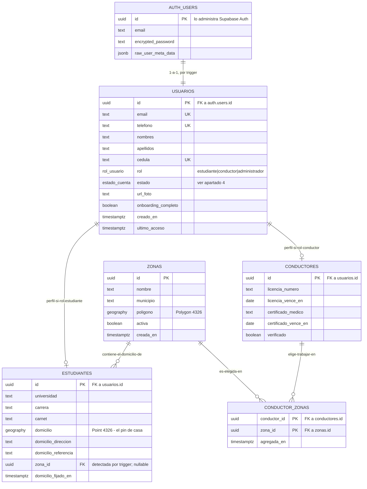
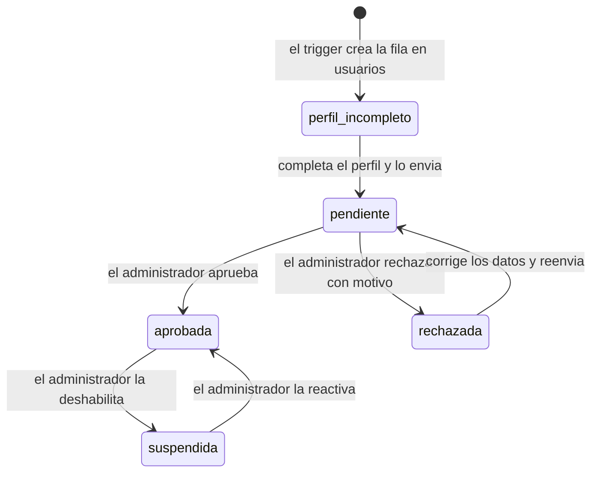
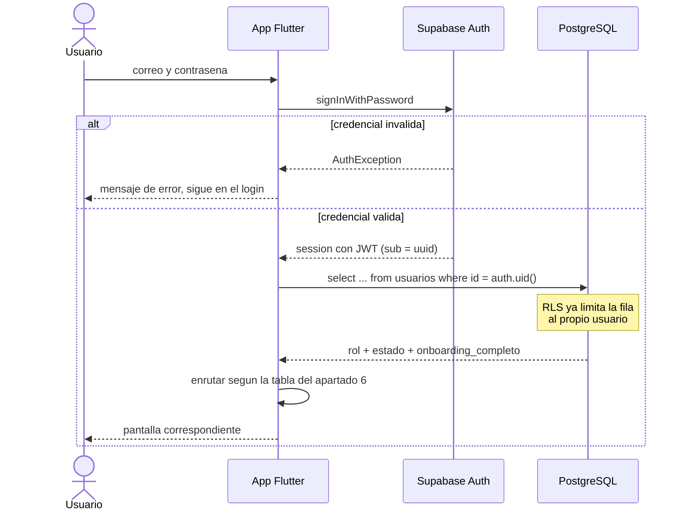
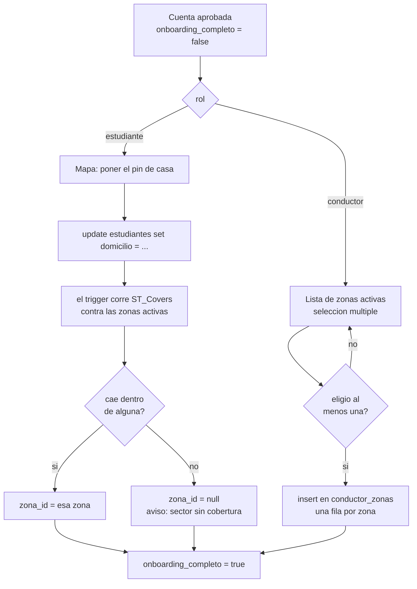

# Documentación Consolidada — Proyecto Cupo

> Este archivo consolida de forma íntegra y exhaustiva todos los documentos en formato Markdown (`.md`) pertenecientes a este repositorio, organizados temáticamente con un índice navegable.

<a id="indice-general"></a>
## 📑 Índice General de Contenidos

### Archivos Principales (Raíz del Repositorio)

1. [README.md](#readme-md) (268 líneas)
2. [CLAUDE.md](#claude-md) (105 líneas)
3. [TODO.md](#todo-md) (72 líneas)
4. [RECUSOS.md](#recusos-md) (1 líneas)

### Aplicación Móvil Flutter (cupo/)

5. [cupo/README.md](#cupo-readme-md) (495 líneas)

### Documentación de Producto (docs/producto/)

6. [docs/producto/README.md](#docs-producto-readme-md) (62 líneas)
7. [docs/producto/modelo-de-datos.md](#docs-producto-modelo-de-datos-md) (681 líneas)

### Documentación de Tesis y Académica (docs/tesis/)

8. [docs/tesis/README.md](#docs-tesis-readme-md) (67 líneas)
9. [docs/tesis/PENDIENTES.md](#docs-tesis-pendientes-md) (236 líneas)

### Sistema de Estudio y Skills (.claude/)

10. [.claude/estudio/progreso.md](#claude-estudio-progreso-md) (29 líneas)
11. [.claude/skills/estudiar/SKILL.md](#claude-skills-estudiar-skill-md) (134 líneas)
12. [.claude/skills/estudiar/preguntas/01-dart.md](#claude-skills-estudiar-preguntas-01-dart-md) (121 líneas)
13. [.claude/skills/estudiar/preguntas/02-flutter.md](#claude-skills-estudiar-preguntas-02-flutter-md) (149 líneas)
14. [.claude/skills/estudiar/preguntas/03-estado.md](#claude-skills-estudiar-preguntas-03-estado-md) (95 líneas)
15. [.claude/skills/estudiar/preguntas/04-firebase.md](#claude-skills-estudiar-preguntas-04-firebase-md) (122 líneas)
16. [.claude/skills/estudiar/preguntas/05-android.md](#claude-skills-estudiar-preguntas-05-android-md) (86 líneas)
17. [.claude/skills/estudiar/preguntas/06-geo.md](#claude-skills-estudiar-preguntas-06-geo-md) (98 líneas)
18. [.claude/skills/estudiar/preguntas/07-pruebas.md](#claude-skills-estudiar-preguntas-07-pruebas-md) (77 líneas)

---

<a id="readme-md"></a>
# Sección 1: `README.md`

> **Ruta original en el proyecto:** `README.md`  
> **Métricas:** 268 líneas | 11288 caracteres  
> **Navegación:** [↑ Volver al Índice General](#indice-general)

# Cupo — sistema de gestión de cupos de transporte estudiantil

Repositorio de la tesis y de la aplicación que la acompaña: una app móvil que
conecta a estudiantes con transportistas para la reserva y el seguimiento de
cupos en rutas y turnos de transporte universitario.

Aquí conviven dos cosas que se tocan pero no se mezclan: **el documento de
tesis** (y su documentación derivada) y **el software** que constituye su
artefacto. La regla de convivencia es simple: la tesis define el alcance, el
software lo cumple, y cada pieza construida debe poder rastrearse hasta un
objetivo específico.

---

## Qué hace la aplicación

Tres actores, cada uno con su recorrido:

- **Estudiante** — marca dónde vive, busca turnos con cupo disponible según sus
  días y horario, se inscribe, confirma su semana y sigue el viaje en curso.
- **Transportista** — administra sus rutas, turnos y zonas de cobertura, ve la
  nómina del día, cobra y lleva la cuenta de cada pasajero.
- **Administrador** — aprueba registros y mantiene el catálogo del sistema.

La pieza técnicamente interesante — y la que sostiene la investigación — es el
**filtrado geográfico en cadena**: dado un domicilio, un turno y unos días,
determinar qué unidades pasan lo bastante cerca como para que caminar tenga
sentido. Eso implica punto en polígono para las zonas de cobertura, distancia
punto-polilínea para las rutas y consultas por radio con geohash en Firestore.

## Estructura del repositorio

```
.
├── cupo/          la aplicación Flutter (Android)
├── docs/
│   ├── tesis/     copias de lectura de los capítulos — NO se editan a mano
│   └── producto/  documentación viva del producto — aquí sí se escribe
├── originales/    los .docx/.pdf entregados a la universidad (fuente de verdad)
└── TODO.md        plan de trabajo por fases, de la 0 a la 6
```

La distinción entre `docs/tesis/` y `docs/producto/` es deliberada y está
explicada en el README de cada carpeta. En resumen: lo primero es material
derivado de `originales/` y se regenera; lo segundo se escribe a mano y se
versiona como cualquier fuente.

## Por dónde empezar

Depende de qué vengas a hacer.

**Si vienes a programar** → [`cupo/README.md`](cupo/README.md). Ahí está todo:
requisitos, creación del proyecto, configuración de Android y Firebase,
extensiones de VS Code, herramientas, qué estudiar antes de escribir código y
recursos para aprenderlo. El entorno de esta máquina ya está montado: lo que
quedó instalado, las desviaciones respecto de ese README y cómo levantar la app
están más abajo, en **Entorno de desarrollo** y **Cómo levantar la app**.

**Si vienes a escribir la tesis** → [`docs/tesis/PENDIENTES.md`](docs/tesis/PENDIENTES.md).
Hay 31 pendientes abiertos, 7 de ellos bloqueantes.

**Si no sabes qué sigue** → [`TODO.md`](TODO.md). Las fases están ordenadas por
dependencia, no por gusto.

## Entorno de desarrollo

Los pasos 1 a 8 de [`cupo/README.md`](cupo/README.md) están ejecutados y
verificados en esta máquina.

### Qué quedó instalado

| Herramienta | Versión | Dónde |
|---|---|---|
| Flutter (canal stable) | 3.47.2 · Dart 3.13.2 | `C:\src\flutter` |
| JDK Temurin | 17.0.20.1 | `%ProgramFiles%\Eclipse Adoptium` |
| Android SDK | ver abajo | `%LOCALAPPDATA%\Android\Sdk` |
| FlutterFire CLI | 1.4.1 | caché de Pub |
| Firebase CLI | 15.29.0 | npm global |
| scrcpy · Bruno | — | winget |

Del Android SDK: `platforms` 35 y 36, `build-tools` 35.0.0, `platform-tools`
37.0.1, NDK 28.2.13676358 y CMake 3.22.1. No hay Android Studio y no hace
falta: bastan los `cmdline-tools`.

Las siete extensiones de VS Code que el README de la app marca como
imprescindibles y recomendadas también están instaladas.

### Variables de entorno

Fijadas a nivel de usuario:

- `JAVA_HOME` → el JDK 17 de la tabla
- `ANDROID_HOME` y `ANDROID_SDK_ROOT` → `%LOCALAPPDATA%\Android\Sdk`
- En el `PATH`: `C:\src\flutter\bin`, `platform-tools`,
  `cmdline-tools\latest\bin` y `%LOCALAPPDATA%\Pub\Cache\bin`

Después de tocarlas hay que **abrir una terminal nueva**: las ya abiertas
conservan el `PATH` viejo.

### Cómo comprobar que el entorno sigue sano

```powershell
cd cupo
flutter analyze          # sin issues
flutter test             # en verde
flutter build apk --debug
```

El último comando es la prueba real: ejercita Gradle, el SDK, el NDK y las
licencias. El APK resultante declara `com.cupo.app`, `minSdkVersion 26`,
`targetSdkVersion 35` y los siete permisos del manifest.

### Desviaciones respecto de `cupo/README.md`

Tres cosas de ese README no sobrevivieron al contacto con las versiones
actuales de las herramientas. Conviene corregirlas allí para que el documento y
el código no se contradigan ante el jurado.

1. **`compileSdk` es 36, no 35.** No es opcional: `firebase_*`,
   `sqflite_android` y `package_info_plus` exigen compilar contra 36, y el
   build falla contra 35. `minSdk = 26` (RNF-01) y `targetSdk = 35` quedan
   intactos: son independientes de `compileSdk`, que solo habilita APIs nuevas
   sin cambiar el comportamiento en ejecución.

2. **`sdkmanager "paquete;version"` ya no funciona.** Google lo deprecó y ahora
   delega en un CLI `android` con otra sintaxis, con `/` en vez de `;`:
   `android sdk install platforms/android-36`. Por lo mismo hubo que instalar
   el NDK a mano —el plugin de Gradle intentaba auto-instalarlo por la vía
   vieja y fallaba.

3. **`flutter doctor` marca dos avisos esperados.** "Android license status
   unknown" es cosmético: el CLI nuevo acepta las licencias al instalar, pero
   el chequeo de Flutter no sabe leerlo; el build real las acepta sin problema.
   El de Visual Studio es para apps de escritorio de Windows, no de Android.

### Avisos que salen en cada build y no son errores

`flutter run` imprime un warning sobre **Kotlin Gradle Plugin (KGP)** en
`firebase_auth`, `firebase_core` y `firebase_database`. Es un aviso de
compatibilidad futura, no un fallo: el build continúa y la app se instala. Se
resolverá solo cuando esos plugins migren a Built-in Kotlin; hay que vigilarlo
al actualizar Flutter, porque en alguna versión futura sí romperá el build.

Junto a él aparece el aviso de KGP de Gradle y, en la primera compilación, la
instalación automática de CMake. Ninguno de los dos requiere acción.

## Cómo levantar la app

En un **teléfono físico**, no en el emulador. El emulador simula mal el GPS y no
reproduce las restricciones de batería del fabricante, que son justamente el
riesgo del Spike 1.

### Preparar el teléfono

El teléfono de pruebas es un **Samsung Galaxy A27 5G (SM-A276B), Android 16**.
Las rutas de menú son las de One UI; en otras capas cambian de nombre pero no
de fondo.

1. **Ajustes → Acerca del teléfono → Información de software** → tocar siete
   veces sobre **Número de compilación**. Aparecen las Opciones de desarrollador.
2. **Ajustes → Opciones de desarrollador** → activar **Depuración por USB**.
3. Conectar el cable y elegir **Transferencia de archivos** en la notificación
   de USB. En "Solo carga" la depuración no funciona.
4. Aceptar el diálogo *"¿Permitir depuración USB?"* y marcar **Siempre permitir
   desde este equipo**.

En ColorOS (Oppo/Realme) y MIUI (Xiaomi) hay un interruptor extra —"Desactivar
monitoreo de permisos" o "Instalar vía USB"— sin el cual se bloquea la
instalación del APK.

### Ejecutar

```powershell
cd cupo
adb devices     # el teléfono debe aparecer como "device"
flutter run
```

Desde VS Code es equivalente: **F5**, con el dispositivo elegido en la barra de
estado.

### Mientras corre

`flutter run` deja la terminal viva:

| Tecla | Qué hace |
|---|---|
| `r` | hot reload — aplica los cambios sin perder el estado de pantalla |
| `R` | hot restart — reinicia la app desde cero |
| `v` | abre DevTools (inspector de widgets, profiler) |
| `q` | salir |

### Si el teléfono no aparece

| Síntoma | Causa habitual |
|---|---|
| `adb devices` vacío | Depuración por USB sin activar, o cable de solo carga |
| `unauthorized` | Falta aceptar la huella RSA en la pantalla del teléfono |
| `offline` | Desconectar y volver a conectar |
| Windows lo ve, `adb` no | Está en MTP sin depuración: revisar el paso 2 |

`adb kill-server` seguido de `adb start-server` resuelve buena parte de los
casos raros.

## Estado actual

El proyecto está en la **Fase 0**: decisiones abiertas. El entorno de desarrollo
ya está montado y el esqueleto de la app existe —compila, corre y pasa sus
pruebas—, pero no implementa todavía ninguna funcionalidad del producto.

Tres cosas bloquean el avance ahora mismo:

1. **Faltan los originales de la tesis.** No hay carpeta `originales/`, y sin
   ella no se puede generar ninguna copia de lectura ni citar el Capítulo I,
   que es donde viven los objetivos específicos que definen el alcance.
2. **Hay decisiones de producto sin cerrar** que cambian el modelo de datos:
   Google Maps SDK contra OSM, si se admiten carros por puesto, cómo se comparte
   un puesto entre días alternos, y el plazo de vencimiento del estado
   "reservado". Están listadas en [`TODO.md`](TODO.md).
3. **El trabajo de campo no se ha aplicado.** Las entrevistas a transportistas y
   el cuestionario a estudiantes van **antes** del modelo de datos. Si la base de
   datos se diseña primero, los requerimientos quedan justificados al revés y
   eso se nota en la defensa.

## Lo esencial, en cuatro puntos

Si solo te llevas cuatro cosas de este README, que sean estas.

1. **El orden de las fases no es negociable.** Campo → requerimientos → diseño →
   construcción. Saltárselo produce un software que quizá funciona, pero cuya
   justificación metodológica no se sostiene.

2. **El Spike 1 va primero, y va esta semana.** Rastrear la ubicación con la app
   minimizada y la pantalla apagada es el riesgo que puede tumbar la
   arquitectura completa. Se prueba en un teléfono físico, no en el emulador.
   Si no funciona como se espera, es mejor saberlo ahora que en la Iteración 5.

3. **Lo que se puede probar sin interfaz, se prueba sin interfaz.** Los cálculos
   geométricos son Dart puro y viven en `cupo/lib/core/geo/`. Sus pruebas
   unitarias son evidencia directa para el Objetivo 4, y cuestan mucho menos que
   evaluar lo mismo a través de la app.

4. **Dos proyectos de Firebase, siempre: desarrollo y demostración.** Y ningún
   secreto en el repositorio: `google-services.json`, `firebase_options.dart`,
   los keystores y los `.env` ya están en el [`.gitignore`](.gitignore), y los
   entornos de Bruno en [`cupo/.gitignore`](cupo/.gitignore), donde vivirá la
   colección.

## Stack

| Capa | Elección |
|---|---|
| App | Flutter · Android · `minSdk 26` (RNF-01) · package `com.cupo.app` |
| Autenticación | Firebase Auth |
| Datos | Cloud Firestore |
| Posiciones en vivo | Firebase Realtime Database |
| Notificaciones | Firebase Cloud Messaging |
| Mapas | por decidir — Google Maps SDK u OSM con `flutter_map` (Fase 0) |
| Metodología | XP — iteraciones que cierran con algo funcionando y probado |

## Convenciones

- La documentación se escribe en español, en markdown, con líneas a 80
  columnas.
- Los documentos de `docs/producto/` citan los objetivos específicos por su
  numeración original del Capítulo I.
- Cada iteración de la Fase 5 cierra con algo que funciona y está probado. Una
  iteración que no corre en un teléfono no está cerrada.

---

<a id="claude-md"></a>
# Sección 2: `CLAUDE.md`

> **Ruta original en el proyecto:** `CLAUDE.md`  
> **Métricas:** 105 líneas | 4509 caracteres  
> **Navegación:** [↑ Volver al Índice General](#indice-general)

# CLAUDE.md — Cupo

Guía obligatoria para cualquier código, pantalla, documento o material visual que
se genere en este repositorio. Todo lo nuevo debe respetar esta identidad.

## Estructura

- `cupo/` — app Flutter (Dart, Material 3, Firebase).
- `cupo/lib/theme/` — sistema de diseño. **Única** fuente de color y tipografía.
- `docs/producto/` — documentación de producto y modelo de datos.
- `docs/tesis/` — documentación académica.

## Identidad visual

### Tipografía

| Familia | Pesos | Uso |
| --- | --- | --- |
| **Manrope** | 400–800 | Toda la UI: títulos, cuerpo, botones, etiquetas |
| **Caveat** | 700 | **Solo** el logotipo "Cupo" |

- En Flutter se cargan con `google_fonts` desde `AppTypography`.
- Caveat solo se usa vía `AppTypography.logo()`. Cualquier otro uso es un error.
- Nunca introduzcas una tercera familia tipográfica.

### Color

La fuente de verdad es OkLCH; el hex es la expresión en sRGB usada en Dart.

**Verde lago (primario)**

| Token | OkLCH | Hex | Uso |
| --- | --- | --- | --- |
| `primary` | `oklch(0.460 0.09 195)` | `#007C8A` | Botones, símbolo, acentos |
| `primaryHover` | `oklch(0.400 0.09 195)` | `#006B78` | Hover / pressed |
| `primaryDeep` | `oklch(0.360 0.09 195)` | `#005F6C` | Texto de marca sobre fondo claro |
| `primaryDarkest` | `oklch(0.240 0.09 195)` | `#003D4B` | Texto de marca de máximo contraste |
| `primarySoft` | `oklch(0.965 0.018 195)` | `#E7F4F5` | Fondo suave de bloques informativos |

**Neutros**

| Token | OkLCH | Hex | Uso |
| --- | --- | --- | --- |
| `ink` | `oklch(0.2 0.01 200)` | `#1C2224` | Tinta, texto principal |
| `textSecondary` | `oklch(0.46 0.01 200)` | `#5F6A6C` | Texto secundario |
| `textSupport` | `oklch(0.55 0.01 200)` | `#798487` | Apoyo |
| `textSupportSoft` | `oklch(0.60 0.01 200)` | `#889396` | Apoyo de menor jerarquía, hints |
| `border` | `oklch(0.89 0.006 200)` | `#DDE0E0` | Bordes y divisores |
| `background` | `oklch(0.975 0.004 200)` | `#F9FCFC` | Fondo base |
| `backgroundAlt` | `oklch(0.965 0.004 200)` | `#F6F9F9` | Fondo alterno |
| `surface` | — | `#FFFFFF` | Tarjetas y hojas |

**Semánticos**

| Token | OkLCH | Hex | Uso |
| --- | --- | --- | --- |
| `success` | `oklch(0.55 0.13 150)` | `#18A06A` | Confirmado |
| `successSoft` | `oklch(0.95 0.05 150)` | `#D3F9E3` | Fondo de confirmado |
| `warning` | `oklch(0.62 0.14 88)` | `#C98A00` | Pendiente / próximo a vencer |
| `warningSoft` | `oklch(0.95 0.06 88)` | `#FFEAC2` | Fondo de pendiente |
| `danger` | `oklch(0.55 0.16 25)` | `#BD413F` | Error / cancelado *(derivado, la marca no lo define)* |
| `dangerSoft` | `oklch(0.95 0.05 25)` | `#FFE2DE` | Fondo de error |

> Los hex de `primary`, `primaryHover`, `primarySoft`, `ink`, `textSecondary`,
> `border`, `success` y `warning` son los aprobados por marca. Los demás se
> derivaron de los mismos valores OkLCH manteniendo la familia de tono.

## Reglas al escribir código

1. **Nunca** escribas un literal de color (`Color(0xFF...)`, `Colors.blue`) fuera
   de `cupo/lib/theme/app_colors.dart`. Usa `AppColors.*` o
   `Theme.of(context).colorScheme.*`.
2. **Nunca** declares `fontFamily`, `GoogleFonts.*` ni `TextStyle` con fuente
   fuera de `cupo/lib/theme/app_typography.dart`. Usa
   `Theme.of(context).textTheme.*` o `AppTypography.manrope(...)`.
3. `ColorScheme.fromSeed` está prohibido: el esquema es explícito en
   `AppTheme.colorScheme`.
4. Un tono nuevo se agrega primero como token en `AppColors` (con su OkLCH en el
   comentario) y se documenta en esta tabla; recién entonces se usa.
5. Radio de esquina estándar: `AppTheme.radius` (12). Elevación por defecto: 0;
   la jerarquía se expresa con `border` y `backgroundAlt`, no con sombras.
6. Espaciado en múltiplos de 4; el padding de pantalla es 16–24.
7. Estados en listas y tarjetas: confirmado → `success` sobre `successSoft`;
   pendiente/vencimiento → `warning` sobre `warningSoft`; error → `danger` sobre
   `dangerSoft`.
8. La app es *light-only* por ahora. Si se agrega tema oscuro, se define como
   `AppTheme.dark` con tokens propios, nunca invirtiendo colores al vuelo.
9. Texto de UI en español (es-VE).

## Reglas al generar material visual y documentos

Mockups, diagramas, presentaciones, capturas y documentos del proyecto usan la
misma paleta y tipografías: Manrope para todo el texto, Caveat 700 únicamente
para el logotipo "Cupo", verde lago como color de acento y los neutros de arriba
para fondos y texto.

## Comandos

```bash
cd cupo
flutter pub get
flutter analyze
flutter test
flutter run
```

---

<a id="todo-md"></a>
# Sección 3: `TODO.md`

> **Ruta original en el proyecto:** `TODO.md`  
> **Métricas:** 72 líneas | 3404 caracteres  
> **Navegación:** [↑ Volver al Índice General](#indice-general)

Fase 0 — Decisiones abiertas

Ninguna de estas es programable, pero todas cambian el modelo. Ciérralas primero.

 Resolver el conflicto del pre-test/post-test con el equipo y el tutor
 Decidir Google Maps SDK o OSM (flutter_map + OSRM). Afecta costos y arquitectura
 Decidir si se admiten carros por puesto de 4 asientos o solo unidades de transporte
 Confirmar con transportistas si un mismo puesto se comparte entre dos personas de días alternos
 Cerrar el estado "reservado" y su plazo de vencimiento
Fase 1 — Campo (Objetivos 1 y 2)
 Redactar el guion de entrevista semiestructurada para transportistas
 Redactar el cuestionario espejo para estudiantes
 Validar ambos instrumentos con el tutor
 Aplicar a 4–6 transportistas y a la muestra de estudiantes
 Tabular y analizar resultados
 Derivar la lista definitiva de requerimientos de esos resultados

Esto va primero por una razón formal: si diseñas la base de datos antes de aplicar los instrumentos, los requerimientos quedan justificados al revés y se nota.

Fase 2 — Prototipos de riesgo (en paralelo con la Fase 3)
 Crear el proyecto Flutter y conectar Firebase (flutterfire configure)
 Spike 1: rastreo de ubicación con la app minimizada y la pantalla apagada
 Spike 2: consulta por radio con geohash en Firestore
 Spike 3: punto en polígono y distancia punto-polilínea, con pruebas unitarias
 Documentar qué funcionó y qué obligó a cambiar el diseño

El Spike 1 es el que puede tumbar tu arquitectura. Hazlo esta semana.

Fase 3 — Diseño lógico y físico (Objetivo 3)

Antes de los diagramas

 Escribir las consultas que la app necesita, en lenguaje natural ("dado un domicilio, un turno y unos días, devolver los turnos con cupo libre")

Diagramas

 Diagrama de casos de uso con los tres actores
 Narrativa de cada caso de uso (precondiciones, flujo principal, alternativos)
 Diagrama de clases
 Diagramas de secuencia de los tres flujos críticos: inscripción, confirmación semanal y viaje en curso
 Diagrama de actividades del filtrado geográfico en cadena
 Diagrama de arquitectura cliente-servidor
 Diagrama de despliegue

Modelo de datos

 Definir colecciones y subcolecciones de Firestore
 Definir qué va en Realtime Database (solo posiciones en vivo) y qué en Firestore
 Decidir la desnormalización necesaria para la tarjeta de resultados
 Definir el campo geohash y los índices compuestos requeridos
 Redactar las reglas de seguridad
 Diccionario de datos con tipos y descripciones
Fase 4 — Diseño de interfaz
 Sistema de diseño en Figma: tipografía, paleta de marca, colores de estado del cupo
 Pantallas críticas primero: "Mi semana" y "Hoy"
 Flujo de onboarding y búsqueda
 Pantallas faltantes del mockup: solicitud enviada y turno lleno con lista de espera
Fase 5 — Construcción por iteraciones

Cada iteración cierra con algo funcionando y probado, como manda XP:

 Iteración 1 — autenticación, registros y aprobación del administrador
 Iteración 2 — rutas, turnos y zonas de cobertura
 Iteración 3 — búsqueda geográfica completa
 Iteración 4 — inscripción, confirmación semanal y nómina diaria
 Iteración 5 — viaje en vivo y notificaciones
 Iteración 6 — cuentas y lista de espera
Fase 6 — Verificación (Objetivo 4)
 Construir el instrumento de evaluación por juicio de expertos según ISO/IEC 25010
 Aplicarlo con tres especialistas
 Pruebas de usabilidad con estudiantes y choferes reales
 Manual de usuario por rol (Objetivo 5)

---

<a id="recusos-md"></a>
# Sección 4: `RECUSOS.md`

> **Ruta original en el proyecto:** `RECUSOS.md`  
> **Métricas:** 1 líneas | 68 caracteres  
> **Navegación:** [↑ Volver al Índice General](#indice-general)

https://claude.ai/code/artifact/ef1177df-857b-445d-8508-7f684c4d38f2

---

<a id="cupo-readme-md"></a>
# Sección 5: `cupo/README.md`

> **Ruta original en el proyecto:** `cupo/README.md`  
> **Métricas:** 495 líneas | 19860 caracteres  
> **Navegación:** [↑ Volver al Índice General](#indice-general)

# Cupo — aplicación móvil

Aplicación Flutter para Android del sistema de gestión de cupos de transporte
estudiantil. Es el artefacto de software de la tesis: cubre los objetivos
específicos 3, 4 y 5 (diseño lógico y físico, verificación y manual de usuario).

- Package: `com.cupo.app`
- Plataforma: Android únicamente (`minSdk 26`, RNF-01)
- Backend: Firebase (Auth, Firestore, Realtime Database, Cloud Messaging)
- Documentación viva del producto: [`../docs/producto/`](../docs/producto/)
- Plan de trabajo: [`../TODO.md`](../TODO.md)

> Esta carpeta contiene por ahora solo este README. El proyecto Flutter se
> genera dentro de ella con el paso 2; `flutter create` completa una carpeta
> existente sin borrar lo que ya está.

---

## 1. Requisitos previos

```bash
flutter --version        # canal stable actual (~3.47)
java -version            # JDK 17
flutter doctor -v
```

No hace falta Android Studio. Basta con los `cmdline-tools` del Android SDK y
apuntar Flutter hacia él:

```bash
flutter config --android-sdk /ruta/al/android-sdk
sdkmanager "platform-tools" "platforms;android-35" "build-tools;35.0.0"
sdkmanager --licenses
```

`flutter doctor` va a marcar la ausencia de Android Studio. Es esperado y no
bloquea la compilación.

## 2. Crear el proyecto

```bash
flutter create --org com.cupo --project-name cupo \
  --platforms=android --empty .
```

- `--org com.cupo` fija el package `com.cupo.cupo`, porque Flutter compone el
  `applicationId` como `<org>.<project-name>`. En el paso siguiente se corrige a
  **`com.cupo.app`**, que es el identificador definitivo. El default es
  `com.example`, y ese sí no puede quedarse: Play Store lo rechaza.
- El nombre del paquete Dart sigue siendo `cupo` (los imports quedan como
  `package:cupo/...`), independiente del `applicationId` de Android.
- `--platforms=android` evita generar iOS, web y desktop. Se puede agregar iOS
  más adelante con `flutter create --platforms=ios .`.
- `--empty` entrega un `main.dart` limpio, sin el contador de demostración.

## 3. Configurar Android

`android/app/build.gradle.kts`:

```kotlin
android {
    compileSdk = 35
    defaultConfig {
        applicationId = "com.cupo.app"
        minSdk = 26        // Android 8.0 — RNF-01
        targetSdk = 35
    }
}
```

El `applicationId` es la identidad definitiva de la app y **no se puede cambiar
después de publicar**. Hay que fijarlo aquí, antes de conectar Firebase: el
`google-services.json` se genera contra ese identificador y si luego no coincide,
la app no autentica.

`minSdk = 26` no es arbitrario: es el requisito no funcional declarado en la
tesis. Debe quedar explícito y coherente con el documento.

Permisos en `android/app/src/main/AndroidManifest.xml`:

```xml
<uses-permission android:name="android.permission.INTERNET"/>
<uses-permission android:name="android.permission.ACCESS_FINE_LOCATION"/>
<uses-permission android:name="android.permission.ACCESS_COARSE_LOCATION"/>
<uses-permission android:name="android.permission.ACCESS_BACKGROUND_LOCATION"/>
<uses-permission android:name="android.permission.FOREGROUND_SERVICE"/>
<uses-permission android:name="android.permission.FOREGROUND_SERVICE_LOCATION"/>
<uses-permission android:name="android.permission.POST_NOTIFICATIONS"/>
```

`ACCESS_BACKGROUND_LOCATION` es el permiso crítico y el más difícil de manejar:
Android lo solicita en un diálogo aparte, después de conceder el permiso normal
de ubicación. Es exactamente lo que debe validar el **Spike 1**.

## 4. Estructura de carpetas

Organización por funcionalidad, no por tipo de archivo. Con capas técnicas
(`models/`, `screens/`, `widgets/`) se termina saltando entre cinco carpetas
para tocar una sola pantalla.

```
lib/
  main.dart
  core/
    config/          constantes, radio peatonal, umbrales
    theme/           tipografía, paleta, colores de estado del cupo
    geo/             punto en polígono, distancia punto-polilínea
    services/        firebase, notificaciones, ubicación
  features/
    auth/
    onboarding/      pin de casa, zona detectada
    search/          días y turno, resultados, detalle
    enrollment/      inscripción, mi semana, lista de espera
    trip/            viaje en curso, seguimiento
    account/         cargos, abonos, saldo
    driver/          hoy, semana, rutas, cobros
  shared/
    models/          entidades compartidas
    widgets/
```

Los cálculos de `core/geo/` son Dart puro, sin dependencias de Flutter ni de
Firebase. Eso permite cubrirlos con pruebas unitarias, y esas pruebas son
evidencia directa para el Objetivo 4.

## 5. Dependencias

```bash
flutter pub add firebase_core firebase_auth cloud_firestore \
  firebase_database firebase_messaging
flutter pub add geolocator flutter_map latlong2 sqflite intl
flutter pub add --dev flutter_lints test
```

Quedan fuera por ahora `flutter_background_geolocation` y
`geoflutterfire_plus`: se agregan cuando lleguen los spikes que los necesitan,
no antes.

## 6. Firebase

```bash
dart pub global activate flutterfire_cli
flutterfire configure --project=<tu-proyecto-firebase>
```

Genera `lib/firebase_options.dart` y `android/app/google-services.json`.
Ninguno de los dos va al repositorio.

Conviene crear **dos proyectos** en la consola de Firebase: uno de desarrollo y
otro para la demostración final. No se quiere estar borrando datos de prueba la
noche antes de la defensa.

## 7. Higiene inicial

`analysis_options.yaml`:

```yaml
include: package:flutter_lints/flutter.yaml
analyzer:
  language:
    strict-casts: true
    strict-raw-types: true
```

`.gitignore` (además de lo que genera Flutter):

```
android/app/google-services.json
lib/firebase_options.dart
*.jks
key.properties
.env
```

## 8. Verificar antes de escribir código

```bash
flutter analyze
flutter test
flutter run -d <tu-teléfono>
```

Si la app vacía compila y corre en un teléfono físico, el entorno está listo.
Ese es el commit inicial.

---

## Herramientas y extensiones

### Extensiones de VS Code — imprescindibles

Sin estas cuatro no se trabaja cómodo. Las dos primeras son obligatorias.

| Extensión | ID | Para qué |
|---|---|---|
| Dart | `Dart-Code.dart-code` | Analizador, autocompletado, formateo, depurador. **Obligatoria.** |
| Flutter | `Dart-Code.flutter` | Hot reload, selector de dispositivo, DevTools, `flutter create` desde la paleta. **Obligatoria.** |
| Error Lens | `usernamehw.errorlens` | Muestra el error en la misma línea, sin ir al panel de problemas. Con null safety, ahorra horas. |
| Awesome Flutter Snippets | `Nash.awesome-flutter-snippets` | `statelessW`, `streamBldr` y demás. Evita escribir el mismo boilerplate cincuenta veces. |

### Extensiones de VS Code — recomendadas

| Extensión | ID | Para qué |
|---|---|---|
| Flutter Riverpod Snippets | `robert-brunhage.flutter-riverpod-snippets` | Solo si se elige Riverpod para el manejo de estado. |
| Pubspec Assist | `jeroen-meijer.pubspec-assist` | Agrega dependencias con la versión correcta sin abrir pub.dev. |
| Dart Data Class Generator | `hzgood.dart-data-class-generator` | Genera `fromJson`/`toJson`/`copyWith` de los modelos. Mucho tiempo ahorrado en la Fase 3. |
| Firebase Explorer | `jsayol.firebase-explorer` | Ver colecciones de Firestore sin salir del editor. |
| Bruno | `bruno-api-client.bruno` | Cliente de API embebido en VS Code (ver abajo). |
| Better Comments | `aaron-bond.better-comments` | Resalta `TODO:` y `FIXME:`, útil con el plan de fases. |
| GitLens | `eamodio.gitlens` | Historial y culpa por línea. |
| Markdown All in One | `yzhang.markdown-all-in-one` | Para la documentación de `docs/`, que es la mitad del trabajo de tesis. |

Instalación en bloque:

```bash
code --install-extension Dart-Code.dart-code \
     --install-extension Dart-Code.flutter \
     --install-extension usernamehw.errorlens \
     --install-extension Nash.awesome-flutter-snippets \
     --install-extension jeroen-meijer.pubspec-assist \
     --install-extension hzgood.dart-data-class-generator \
     --install-extension eamodio.gitlens
```

### Configuración recomendada de VS Code

En `.vscode/settings.json` del proyecto:

```json
{
  "editor.formatOnSave": true,
  "editor.rulers": [80],
  "dart.previewFlutterUiGuides": true,
  "dart.lineLength": 80,
  "[dart]": {
    "editor.defaultFormatter": "Dart-Code.dart-code",
    "editor.codeActionsOnSave": { "source.fixAll": "explicit" }
  }
}
```

`formatOnSave` no es cosmético: elimina por completo las discusiones de estilo y
los diffs sucios en git.

### Bruno — pruebas de endpoints

[Bruno](https://www.usebruno.com) es un cliente de API tipo Postman, pero
**guarda las colecciones como archivos de texto dentro del repositorio**. Eso
importa aquí por dos razones: las peticiones se versionan en git junto al código,
y no hace falta cuenta ni sincronización en la nube.

```bash
# Windows
winget install Bruno.Bruno
# macOS
brew install bruno
```

Convención para este proyecto: colección en `api/` (fuera de `lib/`), con
entornos separados para desarrollo y demostración.

```
api/
  environments/
    dev.bru          # apunta al proyecto Firebase de desarrollo
    demo.bru         # apunta al de la defensa
  auth/
    signup.bru
    signin.bru
  firestore/
    listar-turnos.bru
```

**Importante:** las claves de API y los tokens van en el archivo de entorno, y
los entornos **no se comitean**. Agregar a `.gitignore`:

```
api/environments/*.bru
!api/environments/*.example.bru
```

Para qué sirve concretamente en este proyecto:

- Probar la **API REST de Firebase Auth** (registro y login) sin compilar la app.
- Consultar la **API REST de Firestore** para verificar que un documento quedó
  como se esperaba, o para poblar datos de prueba.
- Golpear las **Cloud Functions** cuando existan, sin pasar por la interfaz.
- Probar **OSRM** o el servicio de rutas que se elija en la Fase 0, y ver la
  respuesta cruda antes de escribir el parser en Dart.

### Herramientas de línea de comandos

| Herramienta | Instalación | Para qué |
|---|---|---|
| **adb** | viene con `platform-tools` | `adb devices`, `adb logcat`, `adb shell dumpsys location`. Indispensable en el Spike 1. |
| **scrcpy** | `winget install Genymobile.scrcpy` | Espeja la pantalla del teléfono en la PC. Vale oro para grabar la demostración de la defensa. |
| **Firebase CLI** | `npm i -g firebase-tools` | Emuladores, despliegue de reglas e índices, `firebase deploy`. |
| **FlutterFire CLI** | `dart pub global activate flutterfire_cli` | Genera `firebase_options.dart` (paso 6). |
| **Flutter DevTools** | incluido en Flutter | Inspector de widgets, profiler, vista de red. Se abre con `flutter run` en curso. |

### Emuladores de Firebase

```bash
firebase init emulators      # auth, firestore, database
firebase emulators:start
```

Vale la pena montarlos antes de la Iteración 1. Permiten probar las reglas de
seguridad y las consultas sin gastar cuota, sin conexión y sin ensuciar el
proyecto de datos reales — que es exactamente lo que hace falta cuando se está
depurando el mismo flujo veinte veces seguidas.

### Dispositivo de pruebas

Un **teléfono físico**, no el emulador. El emulador de Android simula mal el GPS
y no reproduce el comportamiento de la batería ni las restricciones del
fabricante, que son justamente el riesgo del Spike 1. En el teléfono hay que
activar Opciones de desarrollador y Depuración por USB.

---

## Qué estudiar antes de tirar código

El orden importa: cada bloque se apoya en el anterior. No hace falta dominar
todo, sí reconocer los conceptos cuando aparezcan en un error.

### 1. Dart (2–3 días)

Sin esto, todo lo demás se lee como magia.

- Tipado sano: `late`, `final` vs `const`, genéricos.
- **Null safety**: `?`, `!`, `??`, `?.`. Es la fuente número uno de errores de
  compilación al empezar.
- Asincronía: `Future`, `async`/`await`, `Stream`, `StreamBuilder`. Firestore y
  la ubicación son streams; sin entender streams no se avanza.
- Clases: constructores nombrados, `factory`, `copyWith`, `fromJson`/`toJson`.

### 2. Flutter — fundamentos (3–5 días)

- **Todo es un widget**, y la diferencia entre `StatelessWidget` y
  `StatefulWidget`.
- El árbol de widgets y por qué `build` se vuelve a ejecutar.
- Layout: `Column`, `Row`, `Expanded`, `Flexible`, `Stack`, `Padding`,
  `SizedBox`. Vale la pena entender **cómo funcionan las restricciones**
  (constraints go down, sizes go up): evita la mitad de los errores de layout.
- Listas: `ListView.builder`, `ListView.separated`, scroll.
- Navegación: rutas nombradas o `go_router`, y paso de argumentos.
- `Theme`, `TextTheme`, `ColorScheme`: la base del sistema de diseño de la
  Fase 4.
- Formularios: `Form`, `TextFormField`, validación.

### 3. Manejo de estado (2 días)

Antes de elegir librería, entender **por qué** hace falta: `setState` no
alcanza cuando dos pantallas comparten datos.

- `setState` y sus límites.
- `InheritedWidget` en concepto (no hay que escribirlo a mano).
- Elegir **una** solución y quedarse con ella: `provider` o `riverpod` son
  suficientes para este proyecto. No hace falta BLoC.

Decidirlo antes de la Iteración 1 y dejarlo escrito en `docs/producto/`.
Cambiar de manejo de estado a mitad del proyecto cuesta días.

### 4. Firebase (3–4 días)

- Modelo de datos de **Firestore**: colecciones, documentos, subcolecciones. No
  es SQL; la desnormalización es normal y esperada.
- Consultas y sus límites: índices compuestos, por qué no existe el `JOIN`, por
  qué algunas queries fallan hasta crear el índice.
- **Reglas de seguridad**. Es lo que un jurado puede preguntar y lo que casi
  nadie estudia.
- `firebase_auth`: registro, sesión, estado de autenticación como stream.
- Diferencia entre **Firestore** (datos persistentes) y **Realtime Database**
  (posiciones en vivo). Aquí se usan las dos, cada una para lo suyo.
- Cloud Messaging: notificaciones en primer plano vs segundo plano.

### 5. Android: permisos y ciclo de vida (2 días)

Es donde el proyecto puede romperse, así que no conviene improvisarlo.

- Permisos en tiempo de ejecución y el flujo de dos pasos de la ubicación en
  segundo plano.
- **Foreground services** y por qué son obligatorios para rastrear ubicación con
  la pantalla apagada.
- Optimización de batería y restricciones por fabricante (Xiaomi, Huawei y
  Samsung matan servicios en segundo plano de forma agresiva). Esto puede
  aparecer como una limitación legítima en el capítulo de resultados.

### 6. Geo (2 días)

- Coordenadas, latitud/longitud, la fórmula de Haversine.
- **Geohash**: qué es y por qué permite consultas por radio en Firestore.
- Algoritmo de **punto en polígono** (ray casting).
- Distancia de un punto a una polilínea (proyección sobre segmento).

Estos cuatro son el Spike 3 y son Dart puro: se pueden estudiar y probar sin
tocar la interfaz.

### 7. Pruebas (1 día)

- `test` para lógica pura (los cálculos de `core/geo/`).
- `flutter_test` con `testWidgets` para lo visual.
- Escribir primero las pruebas de geometría: son el mejor ejemplo de TDD del
  proyecto y evidencia lista para el Objetivo 4.

### Lo que conviene NO estudiar todavía

Animaciones avanzadas, `CustomPainter`, código nativo con platform channels,
CI/CD, publicación en Play Store, arquitectura limpia con tres capas y cuatro
abstracciones. Nada de eso está en el alcance y consume el tiempo que hace falta
en los spikes.

---

## Recursos

### Dart

| Recurso | Por qué |
|---|---|
| [Dart Language Tour](https://dart.dev/language) | La referencia oficial. Se lee de corrido en unas horas. |
| [Dart Cheatsheet interactivo](https://dart.dev/codelabs/dart-cheatsheet) | Ejercicios en el navegador, sin instalar nada. |
| [Understanding null safety](https://dart.dev/null-safety/understanding-null-safety) | El mejor texto sobre el tema. |
| [Async programming: futures, async, await](https://dart.dev/codelabs/async-await) | Codelab oficial de asincronía. |

### Flutter

| Recurso | Por qué |
|---|---|
| [Flutter — Get started codelab](https://docs.flutter.dev/get-started/codelab) | Primera app guiada. |
| [Flutter Widget of the Week (YouTube)](https://www.youtube.com/playlist?list=PLjxrf2q8roU23XGwz3Km7sQZFTdB996iG) | Videos de 1–3 min por widget. Ideal para ratos muertos. |
| [Layouts in Flutter](https://docs.flutter.dev/ui/layout) | Guía visual de layout. |
| [Understanding constraints](https://docs.flutter.dev/ui/layout/constraints) | Explica el 80 % de los errores de layout. |
| [Flutter Cookbook](https://docs.flutter.dev/cookbook) | Recetas cortas: formularios, listas, navegación, red. |
| [Material 3 en Flutter](https://docs.flutter.dev/ui/design/material) | Base del sistema de diseño de la Fase 4. |
| [DartPad](https://dartpad.dev) | Probar ideas sin crear proyecto. |

### Manejo de estado

| Recurso | Por qué |
|---|---|
| [State management — docs oficiales](https://docs.flutter.dev/data-and-backend/state-mgmt/intro) | Explica el problema antes que las librerías. |
| [Simple app state management (provider)](https://docs.flutter.dev/data-and-backend/state-mgmt/simple) | Suficiente para este proyecto. |
| [Riverpod](https://riverpod.dev) | Alternativa, si se prefiere sobre provider. |

### Firebase

| Recurso | Por qué |
|---|---|
| [FlutterFire](https://firebase.flutter.dev) | Configuración e integración por paquete. |
| [Get to know Cloud Firestore (YouTube)](https://www.youtube.com/playlist?list=PLl-K7zZEsYLluG5MCVEzXAQ7ACZBCuZgZ) | La mejor explicación del modelo de datos NoSQL. |
| [Firestore data model](https://firebase.google.com/docs/firestore/data-model) | Referencia de colecciones y documentos. |
| [Firestore security rules](https://firebase.google.com/docs/firestore/security/get-started) | Obligatorio antes de la Fase 3. |
| [Structure your data (Realtime DB)](https://firebase.google.com/docs/database/web/structure-data) | Para decidir qué va en RTDB. |
| [Firebase Local Emulator Suite](https://firebase.google.com/docs/emulator-suite) | Probar reglas y consultas sin gastar cuota ni ensuciar datos. |

### Android, ubicación y permisos

| Recurso | Por qué |
|---|---|
| [Request location permissions](https://developer.android.com/develop/sensors-and-location/location/permissions) | El flujo de dos pasos del permiso en segundo plano. |
| [Foreground services](https://developer.android.com/develop/background-work/services/foreground-services) | Requisito para el rastreo con pantalla apagada. |
| [geolocator — pub.dev](https://pub.dev/packages/geolocator) | El README del paquete es la mejor documentación práctica. |
| [dontkillmyapp.com](https://dontkillmyapp.com) | Qué hace cada fabricante contra los servicios en segundo plano. |

### Geo

| Recurso | Por qué |
|---|---|
| [Movable Type — cálculos con lat/long](https://www.movable-type.co.uk/scripts/latlong.html) | Haversine y afines, con fórmulas y código. |
| [Geoqueries en Firestore](https://firebase.google.com/docs/firestore/solutions/geoqueries) | Consultas por radio con geohash, explicado por Google. |
| [Point in polygon (W. R. Franklin)](https://wrfranklin.org/Research/Short_Notes/pnpoly.html) | Ray casting en su versión canónica. |
| [flutter_map](https://docs.fleaflet.dev) | Mapas con OSM, si se descarta Google Maps SDK. |

### Para dudas del día a día

- Flutter Community en Discord y r/FlutterDev.
- [Stack Overflow — tag `flutter`](https://stackoverflow.com/questions/tagged/flutter).
- `pub.dev`: antes de instalar un paquete, mirar fecha de última publicación,
  likes y si soporta la versión de Flutter en uso.

---

## Orden sugerido de arranque

1. Estudiar Dart y los fundamentos de Flutter (bloques 1 y 2).
2. Montar el entorno y llegar al commit inicial (pasos 1 a 8).
3. **Spike 1** — ubicación en segundo plano. Es el que puede tumbar la
   arquitectura; hacerlo temprano.
4. Estudiar Firestore y hacer los Spikes 2 y 3.
5. Recién ahí, empezar la Iteración 1.

El detalle de fases y entregables está en [`../TODO.md`](../TODO.md).

---

<a id="docs-producto-readme-md"></a>
# Sección 6: `docs/producto/README.md`

> **Ruta original en el proyecto:** `docs/producto/README.md`  
> **Métricas:** 62 líneas | 2717 caracteres  
> **Navegación:** [↑ Volver al Índice General](#indice-general)

# docs/producto — documentacion editable

## Que es esta carpeta

A diferencia de [../tesis/](../tesis/), **aqui si se edita**. Esta carpeta
contiene la documentacion viva del producto: la que evoluciona mientras se
construye el software.

La distincion importa:

| | `docs/tesis/` | `docs/producto/` |
|---|---|---|
| Origen | generado desde `/originales` | escrito a mano |
| Se edita | no | si |
| Que representa | lo que se entrego a la universidad | lo que estamos construyendo |
| Al cambiar | se regenera completo | se versiona en git como cualquier fuente |

## Que va aqui

- **Especificacion funcional** (`especificacion-funcional.md`) — que hace la
  aplicacion, pantalla por pantalla y caso por caso. Es la traduccion de los
  objetivos especificos del Capitulo I a requerimientos implementables.
- **Hallazgos de campo** (`hallazgos-de-campo.md`) — resultado de las
  entrevistas y observacion: lo que realmente dijeron y hacen los informantes.
  Es la materia prima de los requerimientos y lo que respalda las decisiones de
  diseno cuando alguien pregunta "por que asi".
- **Modelo de datos** (`modelo-de-datos.md`) — entidades, atributos, relaciones
  y decisiones de persistencia.

Se pueden agregar otros documentos (decisiones de arquitectura, plan de pruebas,
manual de usuario) a medida que hagan falta.

## Relacion con la tesis

Los objetivos especificos del Capitulo I son **el contrato de alcance** del
software. Cuando un documento de esta carpeta desarrolle o acote uno de esos
objetivos, conviene citarlo por su numeracion original, por ejemplo:

> Cubre el objetivo especifico 3 (ver `docs/tesis/capitulo-1-el-problema.md`,
> apartado de objetivos especificos).

Asi queda rastreable que cada pieza construida responde a algo comprometido en
la tesis, y se detecta cuando el software se esta saliendo del alcance
declarado.

## Estado

| Documento | Estado |
|---|---|
| `hallazgos-de-campo.md` | no escrito — depende de la Fase 1 |
| `especificacion-funcional.md` | no escrito |
| [`modelo-de-datos.md`](modelo-de-datos.md) | **borrador parcial** — identidad y ubicacion (usuario, estudiante, conductor, zonas), sobre Supabase |

El orden natural seria empezar por los hallazgos de campo, que alimentan a los
otros dos. Del modelo de datos se adelanto unicamente la parte de identidad,
que es la que hace falta para diagramar el login y la Iteracion 1. Las
entidades de la operacion se agregan cuando cierren la Fase 0 y el campo.

**Atencion:** ese documento ya esta escrito sobre **Supabase (PostgreSQL)**,
mientras que `../../README.md`, `../../cupo/README.md`, `../../TODO.md` y
`cupo/pubspec.yaml` todavia describen Firebase. El apartado 10 del modelo
lista que cambia en cada uno.

---

<a id="docs-producto-modelo-de-datos-md"></a>
# Sección 7: `docs/producto/modelo-de-datos.md`

> **Ruta original en el proyecto:** `docs/producto/modelo-de-datos.md`  
> **Métricas:** 681 líneas | 26139 caracteres  
> **Navegación:** [↑ Volver al Índice General](#indice-general)

# Modelo de datos — Cupo

Modelo entidad-relación del sistema sobre **Supabase (PostgreSQL)**. Cubre
el **objetivo específico 3** (diseño lógico y físico).

- Estado: **borrador — identidad y ubicación**
- Motor: PostgreSQL 15 + PostGIS, vía Supabase
- Última revisión: 2026-09-14

## Alcance de esta versión

Solo **quién entra a la aplicación y desde dónde**: cuentas, perfiles, el
estado que gobierna el login, y la ubicación que cada rol declara al
registrarse. Es lo que hace falta para la Iteración 1 del plan
(autenticación, registros y aprobación del administrador).

Las entidades de la operación —rutas, turnos, cupos, inscripciones,
viajes, cobros— **no están en este documento todavía**. Se agregan cuando
cierren las decisiones de la Fase 0 y el trabajo de campo de la Fase 1,
que es lo que corresponde según [`../../TODO.md`](../../TODO.md).

> **Nota de migración.** [`../../README.md`](../../README.md),
> [`../../cupo/README.md`](../../cupo/README.md), `TODO.md` y
> `cupo/pubspec.yaml` todavía describen un backend Firebase. Este
> documento ya está sobre Supabase; los otros cuatro quedan
> contradiciéndolo hasta que se actualicen. El apartado 10 lista qué
> cambia en cada uno.

---

## 1. Diagrama



`conductor_zonas` es la tabla asociativa que resuelve el **N:M** entre
conductores y zonas: un conductor trabaja varias zonas y una zona tiene
varios conductores. Su clave primaria es compuesta, y eso solo ya impide
que un conductor registre dos veces la misma zona.

## 2. Por qué `usuarios` está separada de `auth.users`

Supabase administra `auth.users` en su propio esquema y **no conviene
tocarla**: sus columnas las define Supabase y pueden cambiar entre
versiones. El patrón estándar es una tabla propia en `public` con la
misma clave primaria y una llave foránea hacia ella.

Eso da dos cosas: los datos del negocio quedan bajo control propio, y
`auth.users` sigue siendo la única fuente de la credencial.

Un detalle que en Firebase era un problema y aquí desaparece: la fila de
`usuarios` se crea con un **trigger sobre `auth.users`**, dentro de la
misma transacción que el registro. No puede existir una credencial sin
perfil. En Firebase eso eran dos escrituras separadas y había que manejar
el caso intermedio.

### 2.1 Y por qué `estudiantes` y `conductores` son tablas aparte

1. **El login solo consulta `usuarios`.** Un `select` de una fila decide a
   qué pantalla va la app.
2. **Las políticas RLS se escriben por tabla.** Un estudiante no debe
   poder escribir en el perfil de un conductor; con tablas separadas la
   política es una línea.
3. **Los campos no se solapan.** Una sola tabla tendría `licencia_numero`
   nulo en todos los estudiantes y `carnet` nulo en todos los conductores.
4. **Alguien podría tener los dos roles.** Un conductor que además
   estudia.

Es una **especialización** (herencia de tabla): `usuarios` es el
supertipo, `estudiantes` y `conductores` los subtipos, y comparten la
clave primaria.

## 3. La ubicación: qué se comparte y qué no

Los dos roles declaran ubicación al registrarse, pero **no declaran lo
mismo**. Son distintos en cuatro ejes a la vez:

| | Estudiante | Conductor |
|---|---|---|
| Geometría | un **punto** | un **área** |
| Cantidad | exactamente 1 | varias |
| Cómo se obtiene | lo **pone** en el mapa | las **elige** de una lista |
| Qué significa | "desde aquí salgo" | "aquí recojo pasajeros" |

Por eso **no** hay una tabla `ubicaciones` genérica con un campo `tipo`.
Tendría la mitad de las columnas nulas en cada fila —el polígono nulo en
el estudiante, el punto nulo en el conductor— y esa es exactamente la
clase de tabla que un jurado pregunta por qué existe.

### 3.1 Lo que sí se reutiliza: la tabla `zonas`

El catálogo de sectores de la ciudad es una sola tabla, y los dos roles la
tocan por lados opuestos:

- El **estudiante no elige** su zona. Se le **detecta**: PostGIS evalúa
  `ST_Covers(zona.poligono, estudiante.domicilio)` y el resultado se
  guarda en `estudiantes.zona_id`.
- El **conductor sí elige**, y puede elegir varias. Cada elección es una
  fila de `conductor_zonas`.

Ese es el verdadero punto de reutilización, y no es cosmético: si los dos
terminan apuntando a la misma zona, cruzar oferta con demanda después es
un `join` por `zona_id`, no geometría recalculada en cada búsqueda. **El
cálculo pesado se hace una sola vez**, cuando el estudiante fija su pin.

### 3.2 Lo que se reutiliza en código, no en la base de datos

| Pieza | Dónde vive | La usan |
|---|---|---|
| El objeto `Punto` (`lat`, `lng`) | `lib/shared/models/` | domicilio y, más adelante, paradas y posiciones |
| El widget de mapa para escoger un lugar | `lib/shared/widgets/` | el pin del estudiante; la vista previa de zonas del conductor |

Respuesta corta a "¿se puede reutilizar?": **sí, pero en el código. En el
modelo son dos cosas distintas.**

### 3.3 Por qué el conductor elige de un catálogo y no dibuja su zona

Podría dibujar su propio polígono sobre el mapa. Tres razones para no
hacerlo, al menos ahora:

1. **Dibujar un polígono en un teléfono es una mala experiencia.** Elegir
   "La Limpia" de una lista toma dos segundos.
2. **Si cada quien dibuja el suyo, nunca coinciden.** Dos conductores de
   la misma zona producirían polígonos distintos, y comparar oferta con
   demanda volvería a ser geometría en vez de un `join`.
3. **El catálogo da vocabulario común.** La búsqueda, la tarjeta de
   resultados y las estadísticas hablan todas de "La Limpia".

La contra es que **alguien tiene que cargar el catálogo** antes de que la
app sirva para algo — trabajo del administrador, y hay que contarlo en el
plan.

### 3.4 El caso que rompe el flujo: pin fuera de toda zona

Si el estudiante pone su casa donde ningún polígono activo lo contiene,
`zona_id` queda **nulo**. Hay que decidir qué pasa ahí, porque es el
primer usuario real que va a aparecer:

- **No dejarlo terminar** el registro lo deja trancado sin salida.
- **Dejarlo terminar** con un aviso de "todavía no cubrimos tu sector" es
  lo razonable: la cuenta queda creada, `onboarding_completo` en `true`, y
  cuando el administrador agregue esa zona el estudiante ya está adentro.

El modelo asume lo segundo: `zona_id` es **nullable**, con
`on delete set null`. Vale la pena conservar esos pines sin zona: son
exactamente el dato que dice dónde conviene abrir cobertura.

## 4. Estados de la cuenta

`usuarios.estado` es el campo que gobierna el login entero. Es un **tipo
enumerado de PostgreSQL**, no texto libre: el motor rechaza cualquier
valor fuera de la lista.



`onboarding_completo` es un campo aparte y **está en `usuarios`, no en los
perfiles**, porque los dos roles lo necesitan: el estudiante lo completa
poniendo el pin, el conductor eligiendo al menos una zona. Así la tabla de
enrutamiento consulta una sola columna.

## 5. El login, paso a paso



Lo que importa para implementarlo: **Supabase Auth solo responde quién
eres, no qué puedes hacer**. El rol y el estado viven en `public.usuarios`,
y la app no está realmente autenticada hasta que leyó esa fila. Esa
segunda consulta es parte del login, no algo posterior.

Dos detalles propios de Supabase:

- El estado de sesión se escucha con `onAuthStateChange`, y la fila del
  usuario con una suscripción de **Realtime** a `public.usuarios` filtrada
  por `id`. Si el administrador suspende la cuenta mientras el usuario la
  tiene abierta, la app se entera.
- El JWT trae el `uuid` en `sub`, y eso es lo que devuelve `auth.uid()`
  dentro de las políticas. **No trae el rol** salvo que se agregue como
  *custom claim*; mientras no se agregue, el rol se consulta.

## 6. Tabla de enrutamiento

Traduce el estado a una pantalla. Conviene implementarla como una sola
función, en un solo lugar.

| `rol` | `estado` | `onboarding_completo` | Pantalla destino |
|---|---|---|---|
| cualquiera | `perfil_incompleto` | — | Formulario de perfil del rol |
| cualquiera | `pendiente` | — | "Tu registro está en revisión" |
| cualquiera | `rechazada` | — | Motivo del rechazo, corregir y reenviar |
| cualquiera | `suspendida` | — | "Cuenta deshabilitada" y contacto |
| `estudiante` | `aprobada` | `false` | Onboarding: **poner el pin de casa** |
| `conductor` | `aprobada` | `false` | Onboarding: **elegir zonas de trabajo** |
| `estudiante` | `aprobada` | `true` | Inicio del estudiante |
| `conductor` | `aprobada` | `true` | Inicio del conductor |
| `administrador` | `aprobada` | — | Bandeja de solicitudes |

Ya no hace falta la fila de "usuario sin perfil": el trigger del apartado
8.3 garantiza que la fila exista. Las de `rechazada` y `suspendida` son
las que se olvidan siempre, y las que dejan al usuario en pantalla blanca.

### 6.1 El paso de ubicación en el onboarding

El mismo lugar del flujo, distinto contenido según el rol:



## 7. Diccionario de datos

| Tabla | Descripción | Clave primaria | Relaciones |
|---|---|---|---|
| `usuarios` | Cuenta de acceso, común a los tres roles | `id` (= `auth.users.id`) | 1:1 con `auth.users`; 1:1 opcional con cada perfil |
| `estudiantes` | Perfil del estudiante y su domicilio | `id` → `usuarios.id` | N:1 con `zonas` |
| `conductores` | Perfil del conductor y sus documentos | `id` → `usuarios.id` | 1:N con `conductor_zonas` |
| `zonas` | Catálogo de sectores, lo mantiene el admin | `id` | 1:N con `estudiantes` y con `conductor_zonas` |
| `conductor_zonas` | Zonas donde un conductor quiere trabajar | `(conductor_id, zona_id)` | N:M entre conductores y zonas |

### 7.1 Tipos usados

| Tipo | Para qué |
|---|---|
| `uuid` | todas las claves; el de `usuarios` viene de Supabase Auth |
| `text` | cadenas; en PostgreSQL no hay razón para usar `varchar(n)` |
| `timestamptz` | instantes con zona horaria — **nunca `timestamp` pelado** |
| `date` | fechas de vencimiento de documentos |
| `boolean` | banderas |
| `geography(Point, 4326)` | el domicilio del estudiante, en WGS-84 |
| `geography(Polygon, 4326)` | el polígono de una zona |
| `rol_usuario`, `estado_cuenta` | tipos enumerados propios |

`geography` y no `geometry`: `geography` calcula sobre el elipsoide, así
que las distancias salen en metros reales sin proyectar nada. Para una
ciudad la diferencia es pequeña, pero evita explicar una proyección en la
defensa.

## 8. Esquema físico

### 8.1 Extensiones y tipos

```sql
create extension if not exists postgis;

create type rol_usuario as enum (
  'estudiante', 'conductor', 'administrador'
);

create type estado_cuenta as enum (
  'perfil_incompleto', 'pendiente', 'aprobada', 'rechazada', 'suspendida'
);
```

### 8.2 Tablas

```sql
create table public.usuarios (
  id                  uuid primary key
                        references auth.users (id) on delete cascade,
  email               text not null unique,
  telefono            text unique,
  nombres             text not null default '',
  apellidos           text not null default '',
  cedula              text unique,
  rol                 rol_usuario   not null,
  estado              estado_cuenta not null default 'perfil_incompleto',
  url_foto            text,
  onboarding_completo boolean     not null default false,
  creado_en           timestamptz not null default now(),
  ultimo_acceso       timestamptz
);

create table public.zonas (
  id        uuid primary key default gen_random_uuid(),
  nombre    text not null,
  municipio text,
  poligono  geography(Polygon, 4326) not null,
  activa    boolean     not null default true,
  creada_en timestamptz not null default now(),
  unique (nombre, municipio)
);

create index zonas_poligono_idx on public.zonas using gist (poligono);

create table public.estudiantes (
  id                   uuid primary key
                         references public.usuarios (id) on delete cascade,
  universidad          text,
  carrera              text,
  carnet               text,
  domicilio            geography(Point, 4326),
  domicilio_direccion  text,
  domicilio_referencia text,
  zona_id              uuid references public.zonas (id) on delete set null,
  domicilio_fijado_en  timestamptz
);

create index estudiantes_domicilio_idx
  on public.estudiantes using gist (domicilio);
create index estudiantes_zona_idx on public.estudiantes (zona_id);

create table public.conductores (
  id                   uuid primary key
                         references public.usuarios (id) on delete cascade,
  licencia_numero      text,
  licencia_vence_en    date,
  certificado_medico   text,
  certificado_vence_en date,
  verificado           boolean not null default false
);

create table public.conductor_zonas (
  conductor_id uuid not null
                 references public.conductores (id) on delete cascade,
  zona_id      uuid not null
                 references public.zonas (id) on delete cascade,
  agregada_en  timestamptz not null default now(),
  primary key (conductor_id, zona_id)
);

create index conductor_zonas_zona_idx on public.conductor_zonas (zona_id);
```

El índice GIST sobre `zonas.poligono` es el que hace que la detección de
zona no recorra todos los polígonos. Con veinte zonas no se nota; con
doscientas, sí.

### 8.3 Trigger: crear el perfil al registrarse

```sql
create or replace function public.crear_usuario()
returns trigger
language plpgsql
security definer
set search_path = public
as $$
begin
  insert into public.usuarios (id, email, rol)
  values (
    new.id,
    new.email,
    coalesce(
      (new.raw_user_meta_data ->> 'rol')::rol_usuario,
      'estudiante'
    )
  );
  return new;
end;
$$;

create trigger on_auth_user_created
  after insert on auth.users
  for each row execute function public.crear_usuario();
```

El rol viaja en el `data` del `signUp` de la app y llega como
`raw_user_meta_data`. Es metadato del usuario, así que **el usuario lo
controla**: sirve para elegir entre estudiante y conductor, pero no debe
aceptarse `administrador` por esa vía. Conviene validarlo en la función.

### 8.4 Trigger: detectar la zona del domicilio

Es el punto-en-polígono, y lo corre la base de datos sola:

```sql
create or replace function public.detectar_zona()
returns trigger
language plpgsql
set search_path = public
as $$
begin
  if new.domicilio is not null then
    select z.id into new.zona_id
      from public.zonas z
     where z.activa
       and st_covers(z.poligono, new.domicilio)
     limit 1;

    new.domicilio_fijado_en := now();
  end if;
  return new;
end;
$$;

create trigger estudiantes_detectar_zona
  before insert or update of domicilio on public.estudiantes
  for each row execute function public.detectar_zona();
```

La app solo escribe el punto; `zona_id` se llena solo y no puede quedar
inconsistente con el domicilio. Si las zonas se solapan, el `limit 1`
elige una arbitrariamente — hay que decidir si las zonas pueden solaparse
o si se valida que no (apartado 11).

### 8.5 Políticas RLS

```sql
alter table public.usuarios        enable row level security;
alter table public.estudiantes     enable row level security;
alter table public.conductores     enable row level security;
alter table public.zonas           enable row level security;
alter table public.conductor_zonas enable row level security;

-- Saber si quien consulta es administrador, sin recursion:
-- security definer salta el RLS de la propia tabla usuarios.
create or replace function public.es_admin()
returns boolean
language sql
security definer
stable
set search_path = public
as $$
  select exists (
    select 1 from public.usuarios
     where id = auth.uid() and rol = 'administrador'
  );
$$;

create policy usuarios_ve_el_suyo on public.usuarios
  for select using (auth.uid() = id or public.es_admin());

create policy usuarios_edita_el_suyo on public.usuarios
  for update using (auth.uid() = id)
  with check (auth.uid() = id);

create policy estudiantes_ve_el_suyo on public.estudiantes
  for select using (auth.uid() = id or public.es_admin());

create policy estudiantes_edita_el_suyo on public.estudiantes
  for update using (auth.uid() = id) with check (auth.uid() = id);

create policy conductor_zonas_las_suyas on public.conductor_zonas
  for all using (auth.uid() = conductor_id)
  with check (auth.uid() = conductor_id);

create policy zonas_las_lee_cualquiera on public.zonas
  for select using (auth.role() = 'authenticated');

create policy zonas_las_escribe_el_admin on public.zonas
  for all using (public.es_admin()) with check (public.es_admin());
```

**La función `es_admin()` con `security definer` no es un adorno.** Una
política sobre `usuarios` que consulte `usuarios` para saber el rol entra
en recursión infinita y PostgreSQL la corta con un error. Es el error
número uno de quien escribe RLS por primera vez.

### 8.6 Lo que RLS **no** resuelve: escalar el propio rol

Una política decide **qué filas** se ven o se escriben, no **qué
columnas**. Con la política de arriba, un usuario puede actualizar su
propia fila… incluyendo `rol = 'administrador'`. Eso tumba el control de
acceso entero.

Se cierra con privilegios por columna, que son de PostgreSQL y no de
Supabase:

```sql
revoke update on public.usuarios from authenticated;

grant update (nombres, apellidos, telefono, cedula, url_foto)
  on public.usuarios to authenticated;
```

`rol`, `estado` y `onboarding_completo` quedan fuera de la lista: solo los
cambia el administrador o una función `security definer`. Es la regla más
importante de todo el módulo.

## 9. Consultas que este modelo tiene que responder

Escritas antes que el código, como pide la Fase 3 del plan:

```sql
-- 1. El login: rol y estado del usuario actual.
select rol, estado, onboarding_completo
  from usuarios where id = auth.uid();

-- 2. Zonas activas para la lista del conductor.
select id, nombre, municipio from zonas
 where activa order by nombre;

-- 3. Zonas que un conductor eligio.
select z.* from zonas z
  join conductor_zonas cz on cz.zona_id = z.id
 where cz.conductor_id = auth.uid();

-- 4. Conductores que trabajan en la zona de un estudiante.
--    Es el cruce oferta-demanda, y es un join, no geometria.
select u.nombres, u.apellidos
  from conductor_zonas cz
  join usuarios u on u.id = cz.conductor_id
 where cz.zona_id = (select zona_id from estudiantes
                      where id = auth.uid());

-- 5. Bandeja del administrador.
select * from usuarios where estado = 'pendiente' order by creado_en;

-- 6. Pines sin cobertura: donde conviene abrir zona.
select domicilio_direccion, domicilio from estudiantes
 where zona_id is null;
```

La consulta 4 es la que justifica todo el apartado 3: con el `zona_id` ya
resuelto, cruzar oferta con demanda es un `join` de dos tablas.

## 10. Qué cambia respecto del diseño Firebase

El repositorio todavía documenta Firebase. Esto es lo que hay que revisar:

| Pieza | Firebase | Supabase | Dónde se documenta hoy |
|---|---|---|---|
| Autenticación | Firebase Auth | Supabase Auth (`auth.users`) | `cupo/README.md` §6 |
| Datos | Cloud Firestore | PostgreSQL | `README.md`, tabla de stack |
| Posiciones en vivo | Realtime Database | Supabase Realtime (canal *broadcast*) | `README.md`, `TODO.md` Fase 3 |
| Reglas de acceso | Security Rules | RLS + `grant` por columna | `TODO.md` Fase 3 |
| Consultas geográficas | geohash + cálculo en Dart | PostGIS (`ST_Covers`, `ST_DWithin`) | `TODO.md` Fase 2, Spikes 2 y 3 |
| Paquetes Flutter | `firebase_*` (5) | `supabase_flutter` (1) | `cupo/pubspec.yaml` |
| Notificaciones push | Firebase Cloud Messaging | **sigue siendo FCM** | `README.md` |

Cuatro consecuencias que valen más que el cambio de nombre:

**1. Se acaba la desnormalización.** Buena parte del diseño anterior
existía porque Firestore no tiene `JOIN`. PostgreSQL sí, y con llaves
foráneas reales. Hay menos que mantener y menos por donde
desincronizarse.

**2. El Spike 2 desaparece.** "Consulta por radio con geohash en
Firestore" ya no aplica: en PostGIS eso es `ST_DWithin` con un índice
GIST. El geohash era una forma de simular índices espaciales donde no los
había; aquí los hay.

**3. El Spike 3 cambia de lugar, y hay que decidirlo.** El punto en
polígono y la distancia punto-polilínea pueden seguir en Dart o mudarse a
PostGIS. La ingeniería dice PostGIS: es más rápido, está indexado y no
baja datos al teléfono para filtrarlos. Pero `README.md` justifica los
cálculos en Dart como evidencia del **Objetivo 4** porque son puros y se
prueban con pruebas unitarias.

   Salida recomendada: mover el filtrado a una función SQL, y probarla con
   casos de prueba en SQL —domicilio dentro, fuera, y justo sobre el
   borde—. Sigue siendo evidencia verificable y repetible para el Objetivo
   4; cambia el instrumento, no el argumento. Conviene acordarlo con el
   tutor antes de escribirlo en el capítulo.

**4. Supabase no envía notificaciones push.** No tiene equivalente de
Cloud Messaging. Para las notificaciones de la Iteración 5 hay que
conservar `firebase_messaging` —solo eso, sin el resto del stack— o meter
un tercero. Conviene saberlo ahora y no en la Iteración 5.

## 11. Preguntas abiertas de este módulo

- **¿El conductor es el dueño de la unidad, o trabaja para alguien?** Si
  hay dueños que no manejan, hace falta distinguir *propietario* de
  *chofer* — hoy `conductores` los mezcla. Pregunta para las entrevistas
  de la Fase 1.
- **¿Quién carga el catálogo de zonas y con qué criterio?** ¿Parroquias
  oficiales, sectores como los nombra la gente, o los recorridos que ya
  existen? De esto depende que un estudiante encuentre su sector.
- **¿Pueden solaparse dos zonas?** Hoy el trigger toma la primera que
  coincida. Si no deben solaparse, se valida con una restricción de
  exclusión; si sí, hay que definir el criterio de desempate.
- **¿La zona de trabajo del conductor es la misma que la cobertura de su
  ruta?** Hoy `conductor_zonas` es una **declaración de interés**. Cuando
  entren las rutas habrá que decidir si la cobertura real se deriva de la
  ruta o sigue siendo lo declarado.
- **¿Cómo se verifica que un estudiante es estudiante?** Hoy `carnet` es
  texto libre y el administrador aprueba a ojo. Si hay que subir foto,
  entra Supabase Storage y probablemente un estado más.
- **¿El registro es por correo o por teléfono?** El modelo guarda los dos,
  pero la credencial de Supabase Auth es una sola y hay que elegirla antes
  de la Iteración 1.
- **¿El estudiante puede mover su pin después?** El trigger recalcula
  `zona_id` solo, pero no hay regla sobre cuántas veces se permite ni qué
  pasa con sus inscripciones vigentes cuando el módulo exista.

---

<a id="docs-tesis-readme-md"></a>
# Sección 8: `docs/tesis/README.md`

> **Ruta original en el proyecto:** `docs/tesis/README.md`  
> **Métricas:** 67 líneas | 2683 caracteres  
> **Navegación:** [↑ Volver al Índice General](#indice-general)

# docs/tesis — copias de lectura

## Que es esta carpeta

Aqui viven **copias de lectura en markdown** de los capitulos de la tesis,
generadas a partir de los archivos entregados a la universidad que estan en
`/originales` (`.docx` / `.pdf`).

Sirven para consultar y citar el contenido de la tesis desde el codigo y desde
el resto de la documentacion, sin abrir Word.

## Reglas

1. **`/originales` es la fuente de verdad.** Los `.docx` y `.pdf` de esa carpeta
   son de solo lectura. No se editan, no se renombran, no se mueven.

2. **Los `.md` de esta carpeta NO se editan a mano.** Son material derivado.
   Cualquier cambio hecho aqui se pierde en la siguiente regeneracion y, peor,
   hace que el `.md` deje de reflejar lo que se entrego.

3. **Se regeneran cuando se entrega una version nueva de un capitulo.** El flujo
   es: se entrega el capitulo -> el `.docx` nuevo entra a `/originales` ->
   se regenera el `.md` correspondiente -> se actualiza `fecha_version` y
   `estado` en el frontmatter.

4. **La conversion es literal.** No se corrige ortografia, redaccion, numeracion
   ni citas, aunque esten mal. El `.md` debe reflejar exactamente lo entregado.
   Todo error detectado se anota en [PENDIENTES.md](PENDIENTES.md) en lugar de
   corregirse aqui.

5. **Se conserva la numeracion original** de los apartados (`1.`, `2.1.`,
   `2.1.1.`), porque la usamos para citar internamente.

## Archivos esperados

| Archivo | Capitulo | Estado |
|---|---|---|
| `capitulo-1-el-problema.md` | I — El Problema | **no generado** — falta el original |
| `capitulo-2-marco-teorico.md` | II — Marco Teorico | **no generado** — falta el original |
| `capitulo-3-marco-metodologico.md` | III — Marco Metodologico | **no generado** — original sin confirmar |

> **Ninguna copia de lectura existe todavia.** La carpeta `/originales` no esta
> presente en el repositorio, de modo que no hay de donde generarlas. El detalle
> de que falta y que hay que decidir esta en [PENDIENTES.md](PENDIENTES.md).

## Frontmatter

Cada capitulo generado abre con:

```yaml
---
capitulo: <numero y nombre, p. ej. "III — Marco Metodologico">
fecha_version: <YYYY-MM-DD de la version entregada>
estado: entregado | en revision | borrador
archivo_origen: originales/<nombre exacto del archivo>.docx
---
```

`archivo_origen` apunta al archivo concreto de `/originales` del que salio la
copia. Si no se puede identificar con certeza cual fue el archivo entregado, la
copia no se genera: un `archivo_origen` inventado vuelve el documento inutil
como referencia.

## Donde van los documentos editables

En [../producto/](../producto/). Esta carpeta es solo para material derivado de
la tesis ya entregada.

---

<a id="docs-tesis-pendientes-md"></a>
# Sección 9: `docs/tesis/PENDIENTES.md`

> **Ruta original en el proyecto:** `docs/tesis/PENDIENTES.md`  
> **Métricas:** 236 líneas | 11999 caracteres  
> **Navegación:** [↑ Volver al Índice General](#indice-general)

# PENDIENTES

Lista de trabajo de errores, inconsistencias y dudas detectadas en el material
de la tesis.

**Nada de esto se corrige en las copias de lectura** de `docs/tesis/`: esas
copias deben reflejar exactamente lo entregado. Las correcciones van al `.docx`
original, y de ahí se regenera el `.md`.

- Última revisión: **2026-09-07**
- Pendientes: **31** · Resueltos: **0**
- Por prioridad: **P0** 7 · **P1** 12 · **P2** 7 · **P3** 5

Convención: `- [ ]` pendiente · `- [x]` resuelto · `P0` bloqueante ·
`P1` alta · `P2` media · `P3` baja.

---

## P0 · Bloqueantes — impiden generar las copias de lectura

Ninguna copia de lectura se pudo generar. El repositorio está vacío: no hay
`CLAUDE.md` ni carpeta `/originales`, y no hay ningún `.docx`/`.pdf` de la tesis
dentro del proyecto. El material localizado está en `~/Downloads` y no sirve
como fuente de verdad tal como está.

- [ ] **P0.1 — Confirmar el tema y título real de la tesis.**
      El material encontrado pertenece a tres investigaciones distintas
      (ver [Anexo A](#anexo-a--inventario-de-archivos-encontrados)). Sin esto no
      se puede decidir qué archivo convertir.

- [ ] **P0.2 — Crear `/originales` y colocar ahí solo los archivos propios
      entregados a la universidad.**
      No se copió nada automáticamente: decidir qué archivo es "lo entregado" es
      una decisión de autoría, más aún habiendo dos tesis ajenas mezcladas.

- [ ] **P0.3 — Conseguir el original del Capítulo I (El Problema).**
      No existe **ningún** archivo del Capítulo I en el equipo, en ningún
      formato ni carpeta. `capitulo-1-el-problema.md` no se puede generar.

- [ ] **P0.4 — Conseguir el original del Capítulo II (Marco Teórico).**
      Igual que el anterior: no existe. `capitulo-2-marco-teorico.md` no se
      puede generar.

- [ ] **P0.5 — Indicar, por capítulo, cuál archivo es la versión entregada y con
      qué fecha.**
      Necesario para llenar `archivo_origen` y `fecha_version` del frontmatter.
      Un `archivo_origen` inventado vuelve la copia inútil como referencia.

- [ ] **P0.6 — Revisar a mano `Capítulo-III_V5_FINAL.doc`.**
      1,5 MB, formato binario Word antiguo; **no se pudo extraer su texto**. Por
      el nombre (`V5_FINAL`) podría ser la versión vigente del capítulo.
      Abrirlo en Word y, si es la buena, reguardarlo como `.docx`.

- [ ] **P0.7 — Descargar `REPÚBLICA BOLIVARIANA DE VENEZUELA.docx` de OneDrive.**
      En `~/OneDrive/Dokumente/`. Solo está el marcador en la nube, no el
      archivo, por lo que no se pudo abrir. El nombre sugiere que son la portada
      o las páginas preliminares.

---

## P1 · Integridad de citas — revisar antes de cualquier entrega

- [ ] **P1.1 — Párrafos idénticos a otra tesis. Lo más urgente de la lista.**
      Se detectaron **4 oraciones textualmente idénticas** entre
      `~/Downloads/Capitulo 3.docx` y la tesis de Alzheimer de Chirino, Nava y
      Suárez (2023), una de ellas un bloque de 548 caracteres:
    - [ ] El párrafo completo de **Dudovskiy (2022)** sobre los tres propósitos
          del estudio descriptivo ("describir, explicar y validar...").
    - [ ] `"Este tipo de investigación es popular con temas no cuantificados,
          siendo utilizada para describir varios aspectos del fenómeno."`
    - [ ] `"Este tipo de investigación se utiliza para describir las
          características y/o el comportamiento de la muestra de población..."`
    - [ ] `"A raíz de esta afirmación, puede inferirse que este tipo de
          investigación persigue el fin de brindar solución a una problemática a
          través de la ejecución de un plan dado."`

- [ ] **P1.2 — Reescribir el primer párrafo del Capítulo III: es un empalme de
      las dos tesis ajenas.**
      La oración de apertura ("Para poder seleccionar el tipo de investigación
      correctamente, se debe analizar a fondo el problema a solucionar") es la
      apertura del capítulo de **palma aceitera**; la que le sigue, de **Tamayo
      y Tamayo (2009)**, aparece igual en el de **Alzheimer**.

- [ ] **P1.3 — Verificar `Dudovskiy (2022)`.**
      Citado sin página. Es un sitio web (Business Research Methodology).
      Confirmar si se admite como fuente en las normas de la universidad.

- [ ] **P1.4 — Verificar `Sarango, Pallmay, Sarzosa y Pozo (2024, p. 7)`.**
      Cuatro autores, año muy reciente. Comprobar que exista y que diga lo que
      se le atribuye: afirma que en la investigación proyectiva "los datos se
      recopilan en tiempo real", lo cual **no** es lo que sostiene Hurtado de
      Barrera. Ver también P2.5.

- [ ] **P1.5 — Verificar `Tamayo y Tamayo (2009)`.** Citado sin página.

- [ ] **P1.6 — Resolver la edición de Arias: `(2016, p. 24)` vs `(2012, p. 31)`.**
      La definición de investigación descriptiva ("la caracterización de un
      hecho, fenómeno, individuo o grupo...") se cita como **Arias (2016, p. 24)**
      en `Capitulo 3.docx`, pero como **Arias (2012, p. 31)** en
      `Diseno_de_la_investigacion.docx`. El PDF disponible es el de **2012** y no
      hay edición 2016 entre el material. Unificar a una sola edición y verificar
      la página.

- [ ] **P1.7 — Corregir el apellido truncado `"Barrera (2010, p.567)"`.**
      El apellido de la autora es **Hurtado de Barrera** (Jacqueline Hurtado de
      Barrera). Así truncado es difícil de ubicar en la bibliografía y
      probablemente sea observado en la revisión. Verificar además edición y
      página.

### Verificables ya, con los PDF que están en `~/Downloads/tesis/`

- [ ] **P1.8 — Confirmar que el PDF de Sampieri sea la 6.ª edición (2014).**
      Hacerlo **antes** de P1.9 y P1.10: la paginación cambia entre ediciones y
      de eso dependen las páginas citadas.
- [ ] **P1.9 — `Hernández, Fernández y Baptista (2014, p. 152)`** — diseño no
      experimental, contra `Metodologia_de_la_Investigacion_Sampieri.pdf`.
- [ ] **P1.10 — `Hernández, Fernández y Baptista (2014, p. 154)`** — diseño
      transversal, mismo PDF.
- [ ] **P1.11 — `Arias (2012, p. 31)`** — investigación de campo, contra
      `El-proyecto-de-investigación-F.G.-Arias-2012-pdf-1.pdf`.
- [ ] **P1.12 — `Bernal (2010, p. 118)`** — seccionales o transversales, contra
      `El-proyecto-de-investigación-bernal-pdf.pdf`.

---

## P2 · Consistencia y completitud del Capítulo III

- [ ] **P2.1 — Redactar los apartados faltantes.**
      `Capitulo 3.docx` pasa de "Tipo y diseño de la investigación" directamente
      a "Metodología seleccionada". Falta:
    - [ ] Población / población objeto de estudio, con su **Cuadro 1**
    - [ ] Técnicas e instrumentos de recolección de datos
    - [ ] Recursos

      El capítulo está incompleto **respecto a lo que él mismo anuncia**: su
      introducción declara que "se indican las técnicas e instrumentos de
      recolección de datos utilizados... y los recursos". Los dos archivos
      ajenos sí traen estos apartados.

- [ ] **P2.2 — Fundir los dos `Diseno_de_la_investigacion`: ninguno está
      completo.**

      | | `Diseno_de_la_investigacion.docx` | `Diseno_de_la_investigacion (1).docx` |
      |---|---|---|
      | Fecha | 30/08 14:51 | 30/08 14:58 (más reciente) |
      | Encabezado `DISEÑO DE LA INVESTIGACIÓN` | sí | **no, se perdió** |
      | Párrafo introductorio | sí | **no, se perdió** |
      | Citas textuales | parafraseadas | entrecomilladas |

      La versión más reciente mejoró el manejo de las citas textuales pero perdió
      el encabezado del apartado y su párrafo introductorio.

- [ ] **P2.3 — Decidir si `Powell (2001)` corresponde en la metodología.**
      `Capitulo 3.docx` declara una metodología híbrida de **Beck (1999)** +
      **Kendall y Kendall (2011)** (Fases I–IV a Beck, Fase V a Kendall). El
      archivo de palma aceitera declara la misma estructura de 5 fases pero
      sustentada en **Beck (1999), Powell (2001) y Kendall y Kendall (2011)**.

- [ ] **P2.4 — Cotejar los objetivos específicos con el Capítulo I cuando
      exista.**
      Hoy los cinco objetivos específicos aparecen **únicamente** en el cuadro de
      actividades del Capítulo III, mapeados a las fases. Es contra esa lista que
      habrá que verificar el Capítulo I — y es también el contrato de alcance del
      software.

- [ ] **P2.5 — Unificar la definición de "investigación proyectiva", hoy
      incompatible consigo misma.**
      En el mismo documento se define vía **Barrera (2010)** como "elaboración de
      una propuesta, un plan o procedimiento", y vía **Sarango et al. (2024)**
      como que "los datos se recopilan en tiempo real". Lo segundo no es lo que
      sostiene Hurtado de Barrera.

- [ ] **P2.6 — Reformular la equivalencia "campo = no experimental".**
      `Diseno_de_la_investigacion.docx` atribuye a Arias (2012, p. 31) que el
      autor "deriva de esta característica el carácter no experimental de este
      tipo de estudio, lo que evidencia la correspondencia directa entre el
      diseño de campo y el diseño no experimental". Esa equivalencia es
      interpretación de los autores de la tesis, no afirmación de Arias: él
      clasifica diseño de campo frente a documental y experimental como
      dimensiones distintas. Reformular para no atribuirle una conclusión que no
      hace.

- [ ] **P2.7 — Renombrar `tesis/CAPITULOIII - Corregido.docx`: el nombre miente.**
      No es una versión corregida; es un duplicado byte a byte de
      `CAPITULOIII.docx` (mismo MD5 `c76a71b5...`). El único archivo que
      realmente difiere y se llama "Corregido" está en `~/Downloads/Telegram
      Desktop/`, y ese es la tesis de Alzheimer.

---

## P3 · Tipeo y acentuación

En `Capitulo 3.docx`. **No corregir en el `.md`** — corregir en el original y
regenerar.

- [ ] **P3.1** — `"Tipo y diseño de la investigacion"` (encabezado): falta tilde
      en "investigación".
- [ ] **P3.2** — `"...problema a solucionar.Sobre esto, Tamayo..."`: falta el
      espacio después del punto.
- [ ] **P3.3** — `"la investigacion a realizar se considera proyectiva debido a
      que plantea el desarrollo de una aplicacion movil"`: párrafo entero sin
      tildes (investigación, aplicación, móvil, propósito, transportista).
- [ ] **P3.4** — `"para asi poder especificar"`: falta tilde en "así".
- [ ] **P3.5** — `"Funcionabilidad extra"` (cuadro de actividades, Fase II):
      probablemente debe ser "Funcionalidad extra".

---

## Anexo A · Inventario de archivos encontrados

Los archivos del Capítulo III **no son versiones de un mismo capítulo**: son de
tres investigaciones con temas, autores y años diferentes. Solo los tres
primeros tratan el tema de transporte universitario; los otros dos son de otros
autores y presumiblemente se usaron como modelo.

| Archivo | Tema | Autores en el cuadro de población |
|---|---|---|
| `~/Downloads/Capitulo 3.docx` | App móvil de transporte para comunidad universitaria (SIG) | — |
| `~/Downloads/Diseno_de_la_investigacion.docx` | App móvil de transporte universitario | — |
| `~/Downloads/Diseno_de_la_investigacion (1).docx` | App móvil de transporte universitario | — |
| `~/Downloads/tesis/CAPITULOIII.docx` | App móvil de detección de plagas en palma aceitera | Fuenmayor, Niebles y Zabala (2024) |
| `~/Downloads/Telegram Desktop/CAPITULOIII - Corregido.docx` | Dispositivo de monitoreo para pacientes de Alzheimer | Chirino, Nava y Suárez (2023) |
| `~/Downloads/tesis/Capítulo-III_V5_FINAL.doc` | **no se pudo leer** (ver P0.6) | — |
| `~/OneDrive/Dokumente/REPÚBLICA BOLIVARIANA DE VENEZUELA.docx` | **no se pudo leer** (ver P0.7) | — |

### Los PDF no son capítulos

Son bibliografía de metodología, no material propio. Útiles para verificar citas
(P1.8–P1.12), no para convertir.

| PDF | Uso |
|---|---|
| `Metodologia_de_la_Investigacion_Sampieri.pdf` | P1.8, P1.9, P1.10 |
| `El-proyecto-de-investigación-F.G.-Arias-2012-pdf-1.pdf` | P1.6, P1.11 |
| `El-proyecto-de-investigación-bernal-pdf.pdf` | P1.12 |
| `Dialnet-TiposYClasificacionDeLasInvestigaciones-9541046.pdf` | consulta general |

---

<a id="claude-estudio-progreso-md"></a>
# Sección 10: `.claude/estudio/progreso.md`

> **Ruta original en el proyecto:** `.claude/estudio/progreso.md`  
> **Métricas:** 29 líneas | 730 caracteres  
> **Navegación:** [↑ Volver al Índice General](#indice-general)

# Progreso de estudio — Cupo

Lo mantiene la skill `estudiar`. No hace falta editarlo a mano, pero se puede.

## Marcador por bloque

| # | Bloque | Preguntas | Aciertos | % | Nivel actual |
|---|---|---:|---:|---:|---|
| 1 | Dart | 0 | 0 | — | 1 |
| 2 | Flutter — fundamentos | 0 | 0 | — | 1 |
| 3 | Manejo de estado | 0 | 0 | — | 1 |
| 4 | Firebase | 0 | 0 | — | 1 |
| 5 | Android — permisos y ciclo de vida | 0 | 0 | — | 1 |
| 6 | Geo | 0 | 0 | — | 1 |
| 7 | Pruebas | 0 | 0 | — | 1 |

Nivel: <60 % → 1 · 60–85 % → 1 y 2 · >85 % → 2 y 3.

## Para reforzar

IDs fallados que deben volver a salir. Se quitan tras dos aciertos seguidos.

_(vacío)_

## Historial

Entrada por quiz, la más reciente arriba.

_(sin quizzes todavía)_

---

<a id="claude-skills-estudiar-skill-md"></a>
# Sección 11: `.claude/skills/estudiar/SKILL.md`

> **Ruta original en el proyecto:** `.claude/skills/estudiar/SKILL.md`  
> **Métricas:** 134 líneas | 5700 caracteres  
> **Navegación:** [↑ Volver al Índice General](#indice-general)

---
name: estudiar
description: Quiz obligatorio de Dart/Flutter antes de escribir código nuevo en la app Cupo. Úsala SIEMPRE y sin que te lo pidan antes de empezar cualquier tarea de programación nueva dentro de cupo/ — nueva pantalla, widget, modelo, servicio, spike, iteración del TODO, integración de un paquete o refactor grande — y también cuando el usuario diga /estudiar, "quiz", "pregúntame", "tómame examen", "repaso" o "estudiar Flutter". No aplica a la tesis, a docs/ ni a cambios triviales.
---

# Estudiar — quiz de Flutter antes de programar

Raúl está aprendiendo Flutter mientras construye Cupo. La regla del proyecto es
que no se escribe código nuevo sin haber repasado antes el bloque teórico que
ese código va a usar. Esta skill hace de portero.

El currículo son los 7 bloques de `cupo/README.md` § "Qué estudiar antes de
tirar código". El banco de preguntas vive en `preguntas/`, un archivo por
bloque. El historial vive en `.claude/estudio/progreso.md`.

## Cuándo se dispara

**Sí:**
- Antes de crear o modificar de forma sustancial cualquier `.dart` en `cupo/`.
- Antes de arrancar un spike o una iteración del `TODO.md`.
- Antes de integrar un paquete nuevo (`geolocator`, `flutter_map`, `provider`…).
- Cuando el usuario lo pide explícitamente.

**No:**
- Escritura de tesis, `docs/`, README, commits, git, despliegues.
- Correcciones de una línea, typos, formato, renombrar una variable.
- Si ya hubo quiz en esta misma sesión **y** el bloque relevante es el mismo.
  En ese caso dilo en una línea (`Quiz de Dart ya hecho hoy — sigo`) y continúa.
- Si el usuario dice explícitamente que se salte el quiz. Se respeta, pero lo
  anotas en el historial como `saltado`.

## Protocolo

### 1. Elegir el bloque

Mira qué va a tocar la tarea y elige **un** bloque:

| Si la tarea toca… | Bloque | Archivo |
|---|---|---|
| lógica pura, modelos, `fromJson`, async, streams | 1 · Dart | `preguntas/01-dart.md` |
| pantallas, widgets, layout, navegación, formularios | 2 · Flutter | `preguntas/02-flutter.md` |
| compartir datos entre pantallas, provider/riverpod | 3 · Estado | `preguntas/03-estado.md` |
| Firestore, Auth, RTDB, FCM, reglas | 4 · Firebase | `preguntas/04-firebase.md` |
| permisos, ubicación en segundo plano, manifest | 5 · Android | `preguntas/05-android.md` |
| geohash, punto en polígono, distancias, mapas | 6 · Geo | `preguntas/06-geo.md` |
| escribir o arreglar tests | 7 · Pruebas | `preguntas/07-pruebas.md` |

Si la tarea toca dos bloques, elige el que sea **más nuevo** para el usuario
según el marcador de `.claude/estudio/progreso.md`.

### 2. Preparar el quiz

1. Lee `.claude/estudio/progreso.md` para ver el marcador y la lista de
   refuerzo.
2. Lee **solo** el archivo del bloque elegido.
3. Escoge **3 preguntas**:
   - Si hay IDs de ese bloque en "Para reforzar", la primera sale de ahí.
   - Las demás, sin usar en los últimos 3 quizzes de ese bloque (mira el
     historial).
   - Nivel según el acierto acumulado del bloque: <60 % → nivel 1;
     60–85 % → niveles 1 y 2; >85 % → niveles 2 y 3.

### 3. Preguntar

Una sola llamada a `AskUserQuestion` con las 3 preguntas juntas.

Por cada pregunta:
- `header`: el bloque, corto (`Dart`, `Widgets`, `Firestore`, `Geo`…).
- `question`: el enunciado tal cual del banco.
- `options`: las 4 del banco, **en orden aleatorio** — la correcta no siempre
  primero. `label` = resumen de 2–5 palabras; `description` = el texto completo
  de la opción.
- `multiSelect: false`.

**Prohibido filtrar la respuesta.** Nada de "(Recomendado)", ni descripciones
que suenen más seguras o más completas en la opción correcta, ni distractores
absurdos. Las cuatro opciones deben leerse como plausibles.

### 4. Calificar

Responde con un bloque corto, una línea por pregunta:

```
Quiz · Bloque 4 · Firebase — 2/3

✅ FIRE-01 — correcto.
❌ FIRE-05 — respondiste «…». La correcta era «…».
   Por qué: <la explicación del banco, en tus palabras si aclara más>
   Recurso: <enlace del banco>
✅ FIRE-11 — correcto.
```

Reglas del portero:

- **3/3 o 2/3** → aprobado. Explicas el fallo si lo hubo y sigues con la tarea
  de inmediato.
- **1/3 o 0/3** → no aprobado. Das una mini-lección de 5–10 líneas sobre el
  concepto que falló, con un ejemplo en código de Cupo, y **una segunda ronda
  de 2 preguntas** del mismo bloque. Después de esa segunda ronda continúas con
  la tarea pase lo que pase: el requisito es responder, no acertar.
- Nunca bloquees el trabajo más de una ronda de refuerzo. El quiz es un peaje,
  no un muro.

### 5. Registrar

Actualiza `.claude/estudio/progreso.md`:
- Suma preguntas y aciertos en la fila del bloque, recalcula el %.
- Añade los IDs fallados a "Para reforzar"; quita los que ya se acertaron dos
  veces seguidas.
- Añade una entrada al historial con la fecha de hoy, la tarea que venía
  después, el bloque, el resultado y los IDs usados.

Escribe el archivo **antes** de ponerte con la tarea, no al final.

### 6. Seguir

Retomas la tarea original sin ceremonia. Una línea del tipo
`Sigo con el modelo de Turno` basta.

## Modo repaso

Si el usuario invoca `/estudiar` sin tarea pendiente detrás, no hay portero:
pregunta qué bloque quiere (o propón el de peor marcador), tira 5 preguntas en
vez de 3 y al final resume el marcador actualizado y qué conviene repasar.

Con `/estudiar <bloque>` (`/estudiar geo`, `/estudiar firebase`) vas directo a
ese bloque.

## Ampliar el banco

Si una pregunta se repite demasiado o el usuario pide más, agrega preguntas al
archivo del bloque siguiendo el mismo formato y numeración correlativa. Cada
pregunta nueva necesita: ID, nivel, enunciado, 4 opciones plausibles, la
correcta, el porqué y un enlace de `cupo/README.md` § Recursos.

---

<a id="claude-skills-estudiar-preguntas-01-dart-md"></a>
# Sección 12: `.claude/skills/estudiar/preguntas/01-dart.md`

> **Ruta original en el proyecto:** `.claude/skills/estudiar/preguntas/01-dart.md`  
> **Métricas:** 121 líneas | 8300 caracteres  
> **Navegación:** [↑ Volver al Índice General](#indice-general)

# Bloque 1 · Dart

Prefijo de ID: `DART`. Niveles: 1 básico · 2 intermedio · 3 avanzado.

---

### DART-01 · nivel 1 · `final` vs `const`
¿Qué distingue a `const` de `final` en Dart?
- A) `const` se resuelve en tiempo de compilación; `final` se asigna una sola vez, pero su valor puede calcularse en tiempo de ejecución.
- B) `const` solo sirve para números y cadenas; `final` sirve para cualquier tipo.
- C) Son sinónimos: `const` es la forma antigua y `final` la moderna.
- D) `final` impide modificar el objeto por dentro; `const` solo impide reasignar la variable.

**Correcta:** A · **Por qué:** `const` exige que el valor se conozca al compilar y congela el objeto entero; `final` solo prohíbe reasignar la referencia. La D describe lo contrario. · **Recurso:** https://dart.dev/language/variables

### DART-02 · nivel 1 · `late`
En `late final Database db;`, ¿qué aporta `late`?
- A) Promete que la variable se inicializará antes del primer uso; si se lee antes, salta un error en tiempo de ejecución.
- B) La vuelve nullable de forma implícita, equivalente a `Database?`.
- C) Retrasa la lectura hasta que termine el `Future` que la produce.
- D) La marca como perezosa y la recalcula cada vez que se lee.

**Correcta:** A · **Por qué:** `late` mueve la comprobación de inicialización del compilador al tiempo de ejecución. Si lleva inicializador, este se ejecuta una sola vez, en la primera lectura. · **Recurso:** https://dart.dev/null-safety/understanding-null-safety

### DART-03 · nivel 1 · `?.` y `??`
En `final nombre = usuario?.nombre ?? 'Invitado';`, ¿qué hace cada operador?
- A) `?.` evita llamar a `.nombre` si `usuario` es null y devuelve null; `??` sustituye ese null por `'Invitado'`.
- B) `?.` convierte `usuario` en no-nulo y `??` comprueba que `nombre` no esté vacío.
- C) `?.` lanza una excepción si `usuario` es null y `??` la captura.
- D) Hacen lo mismo: `??` es la forma corta de `?.`.

**Correcta:** A · **Por qué:** `?.` es acceso seguro (corta y devuelve null); `??` es valor por defecto ante null. Ojo: `??` no se dispara con cadena vacía ni con `0`, solo con null. · **Recurso:** https://dart.dev/language/operators

### DART-04 · nivel 2 · el operador `!`
¿Qué implica escribir `posicion!.latitude` sobre una variable de tipo `Position?`?
- A) Le afirmas al compilador que no es null; si en ejecución lo es, la app lanza un error.
- B) Convierte el valor a no-nulo asignándole un valor por defecto cuando es null.
- C) Es una negación lógica aplicada al objeto.
- D) Le indica al analizador que ignore el tipo y lo trate como `dynamic`.

**Correcta:** A · **Por qué:** `!` no comprueba nada: apaga el análisis y traslada el fallo a tiempo de ejecución. Cada `!` es una promesa que tú respaldas. · **Recurso:** https://dart.dev/null-safety/understanding-null-safety

### DART-05 · nivel 1 · `Future` vs `Stream`
La posición del chofer llega continuamente; el perfil del usuario se lee una vez. ¿Qué tipo corresponde a cada uno?
- A) La posición es un `Stream` (muchos valores en el tiempo) y el perfil un `Future` (un único valor futuro).
- B) Al revés: el perfil es un `Stream` porque puede cambiar, y la posición un `Future`.
- C) Ambos son `Future`; `Stream` solo se usa para archivos y sockets.
- D) Ambos son `Stream`; un `Future` es un `Stream` de un elemento y por eso no se usa.

**Correcta:** A · **Por qué:** un `Future` se completa una vez; un `Stream` emite cero, uno o muchos eventos. En Cupo casi todo lo de Firebase en vivo es `Stream`. · **Recurso:** https://dart.dev/codelabs/async-await

### DART-06 · nivel 2 · `async`
¿Qué devuelve una función marcada `async` cuyo cuerpo hace `return 5;`?
- A) Un `Future<int>` que se completa con 5.
- B) Un `int` con valor 5, porque `async` solo afecta al interior de la función.
- C) Un `Stream<int>` con un único evento.
- D) Un `FutureOr<int>` que se resuelve solo si alguien hace `await`.

**Correcta:** A · **Por qué:** marcar `async` envuelve siempre el retorno en un `Future`. Por eso el tipo declarado tiene que ser `Future<int>`. · **Recurso:** https://dart.dev/codelabs/async-await

### DART-07 · nivel 2 · constructor `factory`
¿Qué permite un constructor `factory` que uno normal no?
- A) Decidir qué instancia devolver: una cacheada, una de una subclase o una construida a partir de un `Map`.
- B) Crear objetos sin declarar los campos de la clase.
- C) Ejecutarse de forma asíncrona y devolver un `Future` de la instancia.
- D) Saltarse la llamada al constructor de la superclase.

**Correcta:** A · **Por qué:** un `factory` tiene cuerpo y devuelve una instancia con `return`, no necesariamente nueva. Es lo que hace idiomático `factory Turno.fromMap(...)`. No puede ser `async`. · **Recurso:** https://dart.dev/language/constructors

### DART-08 · nivel 2 · `copyWith`
¿Por qué los modelos inmutables llevan `copyWith`?
- A) Porque con campos `final` no se puede mutar el objeto: se crea uno nuevo cambiando solo lo que hace falta.
- B) Porque Dart lo exige en toda clase con constructor `const`.
- C) Porque es la única forma de hacer una copia profunda de las listas internas.
- D) Porque Firestore lo necesita para serializar el objeto.

**Correcta:** A · **Por qué:** `copyWith` es el sustituto del setter en un modelo inmutable. Ojo: copia superficial — las listas internas se comparten salvo que las clones a mano. · **Recurso:** https://dart.dev/language/classes

### DART-09 · nivel 2 · deserializar
`doc.data()` de Firestore devuelve `Map<String, dynamic>`. ¿Cuál es la forma idiomática de convertirlo en un `Turno`?
- A) Un `factory Turno.fromMap(Map<String, dynamic> map)` que lee cada clave y valida los tipos.
- B) Un cast directo `doc.data() as Turno`, porque Dart infiere la forma del objeto.
- C) `jsonDecode(doc.data())`, que convierte el mapa en la clase destino.
- D) Anotar la clase con `@firestore` para que el SDK la construya sola.

**Correcta:** A · **Por qué:** Dart no tiene reflexión en producción: la conversión se escribe a mano (o la genera un paquete). El cast de B falla en ejecución y `jsonDecode` recibe cadenas, no mapas. · **Recurso:** https://dart.dev/language/constructors

### DART-10 · nivel 3 · streams de suscripción única
¿Qué ocurre si dos widgets llaman a `listen` sobre el mismo `Stream` de suscripción única?
- A) El segundo lanza una excepción: hace falta un stream de difusión (`asBroadcastStream()` o un `StreamController.broadcast`).
- B) Ambos reciben todos los eventos; Dart duplica el stream automáticamente.
- C) El segundo recibe solo los eventos posteriores a su suscripción y el primero deja de recibir.
- D) Los eventos se reparten alternados entre los dos oyentes.

**Correcta:** A · **Por qué:** un stream normal admite un solo oyente. Es un error típico al compartir un stream de Firestore entre pantallas en vez de exponerlo desde un único sitio. · **Recurso:** https://dart.dev/libraries/async/using-streams

### DART-11 · nivel 3 · cascada `..`
¿Qué hace el operador `..`?
- A) Encadena operaciones sobre el mismo objeto y devuelve el objeto, no el resultado de la última operación.
- B) Concatena dos listas conservando el orden.
- C) Define un rango de valores, como `1..10`.
- D) Accede a un miembro solo si el objeto no es null, igual que `?.` en cadena.

**Correcta:** A · **Por qué:** la cascada evita la variable temporal: `Paint()..color = x..strokeWidth = 2` sigue devolviendo el `Paint`. La versión que tolera null es `?..`. · **Recurso:** https://dart.dev/language/operators

### DART-12 · nivel 3 · promoción de tipo
¿Por qué este código no compila?

```dart
class Sesion {
  String? token;
  void usar() { if (token != null) print(token.length); }
}
```

- A) Porque `token` es un campo mutable: Dart no promueve a no-nulo algo que podría cambiar entre la comprobación y el uso; hay que copiarlo a una variable local.
- B) Porque `String?` no tiene la propiedad `length` bajo ninguna circunstancia.
- C) Porque falta marcar el método como `async`.
- D) Porque la comparación correcta es `if (token is String)`: `!= null` no promueve nunca.

**Correcta:** A · **Por qué:** la promoción funciona con variables locales y con campos privados `final`, no con un campo público mutable. La solución: `final t = token; if (t != null) print(t.length);` · **Recurso:** https://dart.dev/null-safety/understanding-null-safety

---

<a id="claude-skills-estudiar-preguntas-02-flutter-md"></a>
# Sección 13: `.claude/skills/estudiar/preguntas/02-flutter.md`

> **Ruta original en el proyecto:** `.claude/skills/estudiar/preguntas/02-flutter.md`  
> **Métricas:** 149 líneas | 10857 caracteres  
> **Navegación:** [↑ Volver al Índice General](#indice-general)

# Bloque 2 · Flutter — fundamentos

Prefijo de ID: `FLU`. Niveles: 1 básico · 2 intermedio · 3 avanzado.

---

### FLU-01 · nivel 1 · Stateless vs Stateful
La tarjeta de resultado de búsqueda solo pinta los datos que recibe por constructor. ¿Qué widget corresponde?
- A) `StatelessWidget`: no guarda estado propio y se reconstruye cuando cambian sus datos de entrada.
- B) `StatefulWidget`, porque los datos vienen de Firestore y pueden cambiar.
- C) Da igual: `StatefulWidget` siempre es más seguro y no tiene coste.
- D) `InheritedWidget`, que es el punto intermedio entre los dos.

**Correcta:** A · **Por qué:** el criterio es si el widget guarda estado *propio* que cambia con el tiempo, no si los datos cambian. Si el dato llega de fuera, es stateless. · **Recurso:** https://docs.flutter.dev/ui/interactivity

### FLU-02 · nivel 1 · `setState`
¿Qué hace exactamente `setState(() { contador++; })`?
- A) Cambia el estado y marca ese elemento como sucio para que Flutter llame de nuevo a `build` en el próximo frame.
- B) Redibuja de inmediato toda la aplicación desde la raíz.
- C) Guarda el valor y notifica a los demás widgets que lo escuchan.
- D) Vuelve a crear el `State` desde cero, ejecutando `initState` otra vez.

**Correcta:** A · **Por qué:** `setState` no pinta nada: programa una reconstrucción de ese subárbol. El `State` sobrevive; `initState` corre una sola vez. · **Recurso:** https://api.flutter.dev/flutter/widgets/State/setState.html

### FLU-03 · nivel 2 · restricciones
"Constraints go down, sizes go up, parent sets position". ¿Qué significa?
- A) El padre pasa restricciones de tamaño al hijo, el hijo elige su tamaño dentro de ellas y el padre lo coloca.
- B) El hijo decide su tamaño libremente y el padre se adapta para no recortarlo.
- C) El tamaño se calcula de arriba abajo en una sola pasada, sin que el hijo opine.
- D) Las restricciones se propagan hacia arriba, desde las hojas hasta la raíz.

**Correcta:** A · **Por qué:** es el modelo de layout completo de Flutter, en una frase. Un widget nunca conoce ni decide su posición: eso lo hace el padre. · **Recurso:** https://docs.flutter.dev/ui/layout/constraints

### FLU-04 · nivel 2 · `Expanded` vs `Flexible`
Dentro de un `Row`, ¿en qué se diferencian?
- A) `Expanded` obliga al hijo a ocupar todo el espacio asignado; `Flexible` le permite ocupar menos si no lo necesita.
- B) `Expanded` funciona en `Row` y `Flexible` solo en `Column`.
- C) `Flexible` reparte a partes iguales y `Expanded` respeta el parámetro `flex`.
- D) `Expanded` recorta al hijo si se pasa, y `Flexible` provoca overflow.

**Correcta:** A · **Por qué:** `Expanded` es literalmente `Flexible` con `fit: FlexFit.tight`. Ambos aceptan `flex` y ambos funcionan en `Row` y `Column`. · **Recurso:** https://docs.flutter.dev/ui/layout

### FLU-05 · nivel 1 · `ListView.builder`
¿Por qué usar `ListView.builder` en vez de `ListView(children: [...])` para la nómina del día?
- A) Porque construye solo los elementos visibles y los recicla al hacer scroll, en vez de crear la lista entera de golpe.
- B) Porque `ListView` normal no admite más de 100 hijos.
- C) Porque `builder` hace la consulta a Firestore por cada fila.
- D) Porque solo `builder` permite separadores entre elementos.

**Correcta:** A · **Por qué:** con `children` construyes todos los widgets aunque no se vean. `builder` construye bajo demanda. (Los separadores los da `ListView.separated`.) · **Recurso:** https://docs.flutter.dev/cookbook/lists/long-lists

### FLU-06 · nivel 2 · `BuildContext`
¿Qué es un `BuildContext`?
- A) La referencia a la posición de ese widget en el árbol, que permite buscar hacia arriba cosas como `Theme` o `Navigator`.
- B) Un objeto con los datos de la pantalla: tamaño, orientación y tema.
- C) El estado mutable del widget, equivalente a `State`.
- D) El contexto de ejecución asíncrono en el que corre `build`.

**Correcta:** A · **Por qué:** de ahí que `Theme.of(context)` funcione: sube por el árbol desde ese punto. Y de ahí que usar un `context` desmontado tras un `await` sea un error. · **Recurso:** https://api.flutter.dev/flutter/widgets/BuildContext-class.html

### FLU-07 · nivel 2 · constructores `const`
¿Qué gana un widget al declararse `const`?
- A) Flutter reutiliza la misma instancia y puede saltarse su reconstrucción cuando el padre se reconstruye.
- B) Se dibuja antes que los widgets no `const`.
- C) Sus campos pasan a ser inmutables, cosa que de otro modo no ocurriría.
- D) Deja de necesitar `key`, porque `const` ya le da identidad única.

**Correcta:** A · **Por qué:** dos widgets `const` idénticos son el mismo objeto, así que la comparación del árbol los descarta sin trabajo. Es la optimización más barata que hay en Flutter. · **Recurso:** https://docs.flutter.dev/perf/best-practices

### FLU-08 · nivel 3 · `Key`
¿Para qué sirve pasar `key` a los elementos de una lista que se reordena o filtra?
- A) Para que Flutter reconozca qué elemento es cuál al comparar el árbol viejo con el nuevo y no mezcle el estado entre filas.
- B) Para identificar el widget en las pruebas, que es su único uso real.
- C) Para acelerar el renderizado saltándose la comparación del árbol.
- D) Para que el `ListView` sepa cuántos elementos hay antes de construirlos.

**Correcta:** A · **Por qué:** sin `key`, Flutter empareja por posición y tipo: al reordenar, el estado (scroll, checkbox, animación) se queda en la posición, no en el dato. · **Recurso:** https://docs.flutter.dev/development/ui/widgets-intro

### FLU-09 · nivel 2 · `StreamBuilder`
Al pintar los turnos con `StreamBuilder`, ¿qué hay que contemplar antes de usar `snapshot.data`?
- A) `connectionState` y `hasError`, y que `data` puede ser null en el primer frame, antes de que llegue el primer evento.
- B) Nada: `StreamBuilder` solo llama al `builder` cuando ya hay datos.
- C) Solo `hasData`; de los errores se encarga Flutter mostrando una pantalla roja.
- D) Que el stream esté cerrado, porque si no los datos son parciales.

**Correcta:** A · **Por qué:** el `builder` se llama de inmediato, antes del primer evento. Los tres estados —cargando, error, datos— hay que pintarlos siempre. · **Recurso:** https://api.flutter.dev/flutter/widgets/StreamBuilder-class.html

### FLU-10 · nivel 2 · `dispose`
¿Qué va en `dispose()` de un `StatefulWidget`?
- A) Cancelar suscripciones a streams y liberar controladores (`TextEditingController`, `AnimationController`) para no filtrar memoria.
- B) Guardar el estado en disco antes de que el widget desaparezca.
- C) Llamar a `setState` una última vez para limpiar la interfaz.
- D) Nada: Flutter libera todo automáticamente al desmontar el widget.

**Correcta:** A · **Por qué:** Flutter desmonta el widget pero no cancela lo que tú suscribiste. Un listener de ubicación vivo tras salir de la pantalla es una fuga clásica. · **Recurso:** https://api.flutter.dev/flutter/widgets/State/dispose.html

### FLU-11 · nivel 2 · formularios
¿Cómo se dispara la validación de un `Form` con varios `TextFormField`?
- A) Con un `GlobalKey<FormState>` en el `Form` y llamando a `_formKey.currentState!.validate()`, que ejecuta el `validator` de cada campo.
- B) Llamando a `validate()` sobre cada `TextFormField`, uno por uno.
- C) Flutter valida solo al perder el foco; no hay que llamar a nada.
- D) Con `setState`, que reevalúa los `validator` al reconstruir.

**Correcta:** A · **Por qué:** el `FormState` coordina a todos sus campos: `validate()` los recorre y `save()` dispara los `onSaved`. · **Recurso:** https://docs.flutter.dev/cookbook/forms/validation

### FLU-12 · nivel 2 · `Theme`
¿Qué ventaja tiene definir la paleta en `ThemeData`/`ColorScheme` y leerla con `Theme.of(context)` en vez de escribir el color en cada widget?
- A) El color queda definido en un solo sitio: cambiarlo, o añadir modo oscuro, no obliga a tocar cada pantalla.
- B) Los colores del tema se dibujan con más precisión que los literales.
- C) Es la única forma de usar colores con opacidad.
- D) `Theme.of(context)` cachea el color y evita reconstruir el widget.

**Correcta:** A · **Por qué:** es la base de la Fase 4 y la razón por la que `lib/theme/app_colors.dart` centraliza los tokens en vez de repartir literales por el código. · **Recurso:** https://docs.flutter.dev/ui/design/material

### FLU-13 · nivel 2 · navegación
¿Cómo se le pasa el `Turno` seleccionado a la pantalla de detalle?
- A) Por el constructor del widget destino dentro del `MaterialPageRoute`, o como `arguments` si la ruta es nombrada.
- B) Con una variable global, porque `Navigator` no transporta objetos.
- C) Serializándolo a JSON dentro del nombre de la ruta.
- D) Guardándolo en `SharedPreferences` justo antes de navegar.

**Correcta:** A · **Por qué:** `Navigator.push(context, MaterialPageRoute(builder: (_) => DetalleTurno(turno: t)))`. Con rutas nombradas, `arguments` y `ModalRoute.of(context)!.settings.arguments`. · **Recurso:** https://docs.flutter.dev/cookbook/navigation/navigate-with-arguments

### FLU-14 · nivel 3 · `build` barato
¿Por qué no se lanza una consulta a Firestore dentro de `build`?
- A) Porque `build` puede ejecutarse muchas veces por segundo y dispararía una consulta en cada reconstrucción.
- B) Porque `build` es síncrono y el código no compilaría.
- C) Porque Firestore bloquea las llamadas hechas desde el hilo de la interfaz.
- D) Porque el `BuildContext` todavía no existe cuando corre `build`.

**Correcta:** A · **Por qué:** `build` debe ser puro y barato: se llama en cada frame que lo necesite. La consulta va en `initState`, en un provider, o se expone como stream a un `StreamBuilder`. · **Recurso:** https://docs.flutter.dev/perf/best-practices

### FLU-15 · nivel 1 · `Stack`
Para poner un badge de "3 cupos" sobre la esquina de una tarjeta, ¿qué se usa?
- A) Un `Stack` con el badge dentro de un `Positioned`.
- B) Un `Column` con `crossAxisAlignment: end`.
- C) Un `Row` con `Spacer` y padding negativo.
- D) Un `Overlay` global, que es la única forma de superponer widgets.

**Correcta:** A · **Por qué:** `Stack` apila hijos en profundidad y `Positioned` los ancla a los bordes. Flutter no tiene padding negativo. · **Recurso:** https://docs.flutter.dev/ui/layout

### FLU-16 · nivel 3 · overflow
Aparece la franja amarilla y negra: "RenderFlex overflowed by 42 pixels". ¿Cuál es la causa típica?
- A) Un hijo pide más espacio del que el `Row`/`Column` tiene disponible y no está envuelto en `Expanded`, `Flexible` ni en un scroll.
- B) Que el widget no tiene `key` y Flutter no puede medirlo.
- C) Que falta llamar a `setState` después de cambiar el tamaño.
- D) Que la imagen supera la resolución de la pantalla.

**Correcta:** A · **Por qué:** un `Text` largo dentro de un `Row` es el caso número uno: se arregla envolviéndolo en `Expanded` (y, si toca, con `overflow: TextOverflow.ellipsis`). · **Recurso:** https://docs.flutter.dev/ui/layout/constraints

---

<a id="claude-skills-estudiar-preguntas-03-estado-md"></a>
# Sección 14: `.claude/skills/estudiar/preguntas/03-estado.md`

> **Ruta original en el proyecto:** `.claude/skills/estudiar/preguntas/03-estado.md`  
> **Métricas:** 95 líneas | 7146 caracteres  
> **Navegación:** [↑ Volver al Índice General](#indice-general)

# Bloque 3 · Manejo de estado

Prefijo de ID: `EST`. Niveles: 1 básico · 2 intermedio · 3 avanzado.

---

### EST-01 · nivel 1 · el límite de `setState`
"Buscar" y "Mi semana" necesitan saber si el estudiante ya se inscribió. ¿Por qué `setState` no basta?
- A) Porque `setState` solo reconstruye el widget que lo llama y su subárbol: no comunica nada a otra rama del árbol.
- B) Porque `setState` no funciona con datos que vienen de Firestore.
- C) Porque solo se puede llamar a `setState` una vez por pantalla.
- D) Porque `setState` es asíncrono y las dos pantallas se desincronizan.

**Correcta:** A · **Por qué:** `setState` es local por diseño. En cuanto dos ramas distintas del árbol necesitan el mismo dato, hace falta algo por encima de ambas. · **Recurso:** https://docs.flutter.dev/data-and-backend/state-mgmt/intro

### EST-02 · nivel 1 · elevar el estado
¿En qué consiste "elevar el estado" (lifting state up)?
- A) Mover el dato al ancestro común más cercano de los widgets que lo necesitan y pasarlo hacia abajo.
- B) Guardar el dato en el nivel más alto posible, siempre en `main.dart`.
- C) Convertir el `StatelessWidget` en `StatefulWidget`.
- D) Subirlo a Firestore para que ambas pantallas lo lean de ahí.

**Correcta:** A · **Por qué:** el ancestro *más cercano*, no la raíz: subirlo más de lo necesario reconstruye media app en cada cambio. · **Recurso:** https://docs.flutter.dev/data-and-backend/state-mgmt/intro

### EST-03 · nivel 2 · `InheritedWidget`
¿Qué problema resuelve un `InheritedWidget`?
- A) Deja un dato disponible para todo su subárbol sin pasarlo por el constructor de cada widget intermedio.
- B) Permite que un hijo modifique el estado del padre sin callbacks.
- C) Hace que el estado sobreviva al cierre de la aplicación.
- D) Comparte estado entre widgets de ramas distintas que no tienen ancestro común.

**Correcta:** A · **Por qué:** evita el *prop drilling*. Solo llega a su subárbol, por eso los providers se montan arriba. Es el mecanismo detrás de `Theme.of`, `MediaQuery.of` y de `provider`. · **Recurso:** https://docs.flutter.dev/data-and-backend/state-mgmt/simple

### EST-04 · nivel 2 · `ChangeNotifier`
En `provider`, ¿qué hace `notifyListeners()`?
- A) Avisa a los widgets suscritos a ese `ChangeNotifier` para que se reconstruyan.
- B) Guarda los cambios en el almacenamiento local.
- C) Reconstruye toda la aplicación desde `MaterialApp`.
- D) Envía el cambio al servidor y espera confirmación.

**Correcta:** A · **Por qué:** el `ChangeNotifier` guarda el estado y `notifyListeners` es la señal. Si cambias un campo y no lo llamas, la interfaz se queda con el valor viejo. · **Recurso:** https://docs.flutter.dev/data-and-backend/state-mgmt/simple

### EST-05 · nivel 2 · `read` vs `watch`
¿Cuándo se usa `context.read<X>()` y cuándo `context.watch<X>()`?
- A) `watch` dentro de `build`, para reconstruir cuando el dato cambie; `read` en callbacks como `onPressed`, donde solo se invoca una acción.
- B) Al revés: `read` en `build` porque es más barato, y `watch` en los callbacks.
- C) `read` para datos locales y `watch` para datos remotos.
- D) Son equivalentes: `watch` es solo el nombre nuevo de `read`.

**Correcta:** A · **Por qué:** `watch` suscribe, `read` no. Usar `watch` en un callback lanza un error, y usar `read` en `build` deja la interfaz congelada. · **Recurso:** https://pub.dev/packages/provider

### EST-06 · nivel 3 · notificar en `build`
¿Por qué no se llama a `notifyListeners()` —ni se crea un provider— dentro de `build`?
- A) Porque provocaría una reconstrucción que dispararía otra notificación: un bucle infinito de frames.
- B) Porque `build` no tiene acceso al `BuildContext` necesario.
- C) Porque provider prohíbe más de una notificación por segundo.
- D) Porque el estado se perdería al rotar la pantalla.

**Correcta:** A · **Por qué:** `build` debe ser puro: sin efectos secundarios. Los cambios de estado van en callbacks, en `initState` o en respuesta a un evento, nunca durante la construcción. · **Recurso:** https://docs.flutter.dev/data-and-backend/state-mgmt/simple

### EST-07 · nivel 2 · elegir una y quedarse
El README pide elegir la solución de estado antes de la Iteración 1 y no cambiarla. ¿Cuál es la razón de fondo?
- A) Cambiar de solución a mitad implica reescribir cómo cada pantalla obtiene y observa sus datos, y eso atraviesa toda la app.
- B) Flutter no permite tener dos librerías de estado instaladas a la vez.
- C) Firebase solo es compatible con una de las dos.
- D) Porque el jurado exige justificar la librería en el capítulo de metodología.

**Correcta:** A · **Por qué:** el manejo de estado no es una capa aislada: define la forma de cada widget que consume datos. Migrarlo cuesta días que en esta tesis no sobran. · **Recurso:** https://docs.flutter.dev/data-and-backend/state-mgmt/options

### EST-08 · nivel 3 · el estado de sesión
El router, el perfil y cada pantalla que muestra el nombre necesitan el usuario autenticado. ¿Dónde vive ese estado?
- A) En un único proveedor cerca de la raíz que expone el stream de `authStateChanges()`, y cada pantalla lo observa desde ahí.
- B) En el `State` de cada pantalla, suscribiéndose por separado al mismo stream.
- C) En una variable global `static User? usuarioActual` que se actualiza al iniciar sesión.
- D) En `SharedPreferences`, leyéndolo en cada `build`.

**Correcta:** A · **Por qué:** una sola fuente de verdad y una sola suscripción. La B multiplica listeners sobre un stream de suscripción única y la C no notifica a nadie cuando cambia. · **Recurso:** https://firebase.flutter.dev/docs/auth/usage

### EST-09 · nivel 3 · granularidad
Una pantalla observa un provider con toda la búsqueda (filtros, resultados, estado de carga). Al escribir en el campo de texto se reconstruye la lista entera. ¿Qué falla?
- A) La pantalla observa demasiado: conviene partir el estado o usar `Selector`/`context.select` para escuchar solo el trozo que ese widget pinta.
- B) Falta llamar a `setState` además de `notifyListeners`.
- C) El provider debería estar en la raíz de la app en vez de en la pantalla.
- D) Es inevitable: cualquier cambio en un provider reconstruye a todos sus consumidores.

**Correcta:** A · **Por qué:** D es lo que ocurre *si no haces nada*, pero es evitable. La granularidad de la suscripción es lo que separa una app fluida de una que parpadea al teclear. · **Recurso:** https://pub.dev/packages/provider

### EST-10 · nivel 3 · Riverpod vs Provider
¿Cuál es la diferencia práctica más citada entre Riverpod y Provider?
- A) En Riverpod los providers se declaran fuera del árbol de widgets y no dependen del `BuildContext`, así que los errores de "provider no encontrado" se detectan al compilar y no en ejecución.
- B) Riverpod es la única de las dos que soporta estado asíncrono.
- C) Provider es de Google y Riverpod es de terceros sin mantenimiento.
- D) Riverpod sustituye a `setState` incluso para el estado local de un widget.

**Correcta:** A · **Por qué:** Riverpod nació precisamente para quitar la dependencia del `BuildContext`. Para Cupo cualquiera de las dos sirve: lo que importa es decidir una. · **Recurso:** https://riverpod.dev

---

<a id="claude-skills-estudiar-preguntas-04-firebase-md"></a>
# Sección 15: `.claude/skills/estudiar/preguntas/04-firebase.md`

> **Ruta original en el proyecto:** `.claude/skills/estudiar/preguntas/04-firebase.md`  
> **Métricas:** 122 líneas | 9677 caracteres  
> **Navegación:** [↑ Volver al Índice General](#indice-general)

# Bloque 4 · Firebase

Prefijo de ID: `FIRE`. Niveles: 1 básico · 2 intermedio · 3 avanzado.

---

### FIRE-01 · nivel 1 · el modelo de datos
¿Cómo se organiza Firestore?
- A) Colecciones que contienen documentos, y cada documento puede tener subcolecciones; los datos siempre viven dentro de documentos.
- B) Tablas con filas y columnas de esquema fijo, como en SQL.
- C) Un único árbol JSON gigante donde cualquier nodo puede ser un valor.
- D) Documentos que contienen otros documentos anidados, sin límite de profundidad.

**Correcta:** A · **Por qué:** colección → documento → subcolección, alternando siempre. La C describe Realtime Database, que sí es un árbol JSON único. · **Recurso:** https://firebase.google.com/docs/firestore/data-model

### FIRE-02 · nivel 1 · sin `JOIN`
La tarjeta de resultados muestra el nombre del transportista junto al turno, y en Firestore no hay `JOIN`. ¿Qué se hace?
- A) Desnormalizar: guardar una copia del nombre dentro del documento del turno, asumiendo el coste de actualizarla si cambia.
- B) Hacer una lectura extra por cada turno de la lista para traer al transportista.
- C) Crear una vista materializada con `collectionGroup`.
- D) Normalizar más, separando el nombre en su propia colección para no duplicarlo.

**Correcta:** A · **Por qué:** en NoSQL se modela según cómo se lee, no según la forma canónica del dato. La B es el problema N+1: 20 turnos son 21 lecturas facturadas. · **Recurso:** https://firebase.google.com/docs/firestore/data-model

### FIRE-03 · nivel 2 · índices compuestos
Una consulta con `where('turnoId', ...)` más `orderBy('hora')` falla con un error que trae un enlace. ¿Qué pasa?
- A) Falta un índice compuesto: Firestore no ejecuta consultas que combinan filtro y orden sobre campos distintos sin él, y ese enlace lo crea.
- B) Los campos no existen en todos los documentos y hay que rellenarlos.
- C) Se superó la cuota de lecturas del día.
- D) `orderBy` no se puede combinar con `where` bajo ninguna circunstancia.

**Correcta:** A · **Por qué:** Firestore indexa cada campo por separado de forma automática; las combinaciones hay que declararlas. El error trae la URL que lo crea con un clic. · **Recurso:** https://firebase.google.com/docs/firestore/query-data/indexing

### FIRE-04 · nivel 2 · dónde corren las reglas
¿Dónde se evalúan las reglas de seguridad de Firestore?
- A) En el servidor, en cada petición: aunque alguien modifique la app, no puede saltárselas.
- B) En el cliente, dentro del SDK, antes de enviar la petición.
- C) Solo en el emulador local; en producción se usan los roles de IAM.
- D) En Cloud Functions, que hacen de intermediarias obligatorias.

**Correcta:** A · **Por qué:** el cliente de Firebase habla directo con la base de datos, así que las reglas *son* el backend de seguridad. No hay otra capa donde validar. · **Recurso:** https://firebase.google.com/docs/firestore/security/get-started

### FIRE-05 · nivel 3 · reglas y consultas
Una regla permite leer solo los documentos donde `uid == request.auth.uid`. El cliente hace `collection('inscripciones').get()` sin filtro. ¿Qué ocurre?
- A) La consulta entera falla: las reglas no filtran resultados, solo aprueban o rechazan la consulta completa.
- B) Devuelve solo los documentos del usuario: las reglas actúan como filtro automático.
- C) Devuelve todos los documentos y el SDK descarta los no permitidos al leerlos.
- D) Devuelve una lista vacía, sin error.

**Correcta:** A · **Por qué:** es el malentendido más común de Firestore. La regla evalúa si la *consulta* puede garantizar que solo pedirá lo permitido; el cliente debe incluir el `where('uid', isEqualTo: ...)` explícito. · **Recurso:** https://firebase.google.com/docs/firestore/security/rules-query

### FIRE-06 · nivel 1 · `get()` vs `snapshots()`
¿Cuándo se usa cada uno?
- A) `.snapshots()` cuando la interfaz debe reaccionar a cambios en vivo; `.get()` para una lectura puntual.
- B) `.snapshots()` para un documento y `.get()` para una colección.
- C) `.get()` lee de la caché local y `.snapshots()` siempre del servidor.
- D) Son equivalentes; `.snapshots()` es la versión con `async/await`.

**Correcta:** A · **Por qué:** `.get()` devuelve un `Future` y `.snapshots()` un `Stream` que emite en cada cambio. Elegir mal es pagar lecturas de más o mostrar datos rancios. · **Recurso:** https://firebase.google.com/docs/firestore/query-data/listen

### FIRE-07 · nivel 2 · Firestore vs Realtime Database
En Cupo, ¿por qué la posición en vivo del vehículo va en Realtime Database y no en Firestore?
- A) Porque son escrituras muy frecuentes de un dato efímero: RTDB está pensada para eso y sale más barata; Firestore cobra por operación y tiene un límite de escritura sostenida por documento.
- B) Porque Firestore no admite números decimales como la latitud.
- C) Porque RTDB es la única que funciona sin conexión.
- D) Porque Firestore no tiene listeners en tiempo real.

**Correcta:** A · **Por qué:** las dos son en tiempo real; lo que cambia es el perfil de coste y de escritura. Posición del viaje → RTDB; datos que persisten y se consultan → Firestore. · **Recurso:** https://firebase.google.com/docs/database/rtdb-vs-firestore

### FIRE-08 · nivel 3 · el coste
¿Cómo se factura una consulta que devuelve 50 turnos en Firestore?
- A) Como 50 lecturas de documento: el coste crece con los documentos devueltos, no con el número de consultas.
- B) Como una lectura, porque es una sola consulta.
- C) Por bytes transferidos, sin contar documentos.
- D) No se factura si la consulta usa un índice.

**Correcta:** A · **Por qué:** es la razón económica de la desnormalización y de paginar los resultados. Una pantalla que reconstruye su consulta en cada `build` puede costar dinero de verdad. · **Recurso:** https://firebase.google.com/docs/firestore/pricing

### FIRE-09 · nivel 2 · `authStateChanges()`
`FirebaseAuth.instance.authStateChanges()` devuelve un `Stream<User?>`. ¿Qué implica para el arranque de la app?
- A) Que la pantalla inicial se decide observando ese stream, y que el primer valor puede tardar un instante mientras se restaura la sesión guardada.
- B) Que hay que llamarlo dentro de cada `build` para saber si hay sesión.
- C) Que la sesión se pierde al cerrar la app y siempre se arranca en null.
- D) Que emite un valor solo cuando el usuario pulsa iniciar o cerrar sesión.

**Correcta:** A · **Por qué:** si decides la pantalla antes del primer evento, mandas a login a un usuario que sí tenía sesión. Por eso el arranque muestra un splash mientras llega el primer valor. · **Recurso:** https://firebase.flutter.dev/docs/auth/usage

### FIRE-10 · nivel 3 · FCM en segundo plano
Para manejar una notificación con la app cerrada en Android, el handler de Firebase Messaging debe…
- A) …ser una función de nivel superior (o `static`), anotada con `@pragma('vm:entry-point')` y registrada con `onBackgroundMessage`: corre en un isolate aparte, sin acceso al estado de la interfaz.
- B) …estar dentro del `State` de la pantalla principal, que Flutter mantiene viva.
- C) …ser un método de instancia registrado en `initState`.
- D) …no existir: con la app cerrada la notificación la muestra Android y no se puede ejecutar código.

**Correcta:** A · **Por qué:** el isolate de segundo plano arranca desde cero, sin el árbol de widgets ni los providers. Todo lo que necesite hay que inicializarlo dentro del propio handler. · **Recurso:** https://firebase.flutter.dev/docs/messaging/usage

### FIRE-11 · nivel 2 · el emulador
¿Para qué sirve el Local Emulator Suite en este proyecto?
- A) Para probar reglas de seguridad y consultas contra una instancia local, sin gastar cuota ni ensuciar los datos reales.
- B) Para emular un teléfono Android sin instalar Android Studio.
- C) Para generar datos de prueba a partir del esquema, automáticamente.
- D) Para desplegar la app en un servidor de pruebas accesible desde internet.

**Correcta:** A · **Por qué:** las reglas se prueban escribiendo casos que *deben* fallar. Hacerlo contra producción es lento, caro y deja basura. · **Recurso:** https://firebase.google.com/docs/emulator-suite

### FIRE-12 · nivel 3 · consultas por radio
Firestore no soporta consultas por radio de forma nativa. ¿Cómo se resuelve?
- A) Guardando un geohash en cada documento y consultando rangos de prefijos ordenados, con un filtro exacto de distancia después, en el cliente.
- B) Con `where('distancia', isLessThan: 2000)`, calculando la distancia dentro de la propia consulta.
- C) Usando el tipo `GeoPoint`, que Firestore indexa por proximidad.
- D) Descargando la colección entera y filtrando en el cliente, que es la práctica recomendada.

**Correcta:** A · **Por qué:** es exactamente el Spike 2. `GeoPoint` se guarda pero no se indexa espacialmente, y la distancia no es un campo almacenado: depende de dónde esté el usuario. · **Recurso:** https://firebase.google.com/docs/firestore/solutions/geoqueries

### FIRE-13 · nivel 3 · transacciones
Dos estudiantes pulsan "inscribirme" en el último cupo a la vez. ¿Cómo se evita que entren los dos?
- A) Con una transacción o una escritura por lotes: leer el contador de cupos y escribir la inscripción de forma atómica, reintentando si el documento cambió mientras tanto.
- B) Leyendo el cupo antes y comprobando en el cliente que sea mayor que cero.
- C) Con una regla de seguridad que compare la hora de las dos peticiones.
- D) No hace falta: Firestore serializa las escrituras y la segunda falla sola.

**Correcta:** A · **Por qué:** una comprobación en el cliente tiene una ventana entre la lectura y la escritura. `runTransaction` cierra esa ventana. · **Recurso:** https://firebase.google.com/docs/firestore/manage-data/transactions

---

<a id="claude-skills-estudiar-preguntas-05-android-md"></a>
# Sección 16: `.claude/skills/estudiar/preguntas/05-android.md`

> **Ruta original en el proyecto:** `.claude/skills/estudiar/preguntas/05-android.md`  
> **Métricas:** 86 líneas | 6865 caracteres  
> **Navegación:** [↑ Volver al Índice General](#indice-general)

# Bloque 5 · Android — permisos y ciclo de vida

Prefijo de ID: `AND`. Niveles: 1 básico · 2 intermedio · 3 avanzado.

---

### AND-01 · nivel 1 · el permiso en dos pasos
¿Cómo se obtiene el permiso de ubicación en segundo plano en Android moderno?
- A) En dos pasos: primero se concede el permiso mientras se usa la app y, más tarde y con una justificación, se envía al usuario a los ajustes para elegir "Permitir siempre".
- B) En un solo diálogo que pide los dos permisos a la vez.
- C) Basta con declararlo en el manifest; no aparece ningún diálogo.
- D) Solo se puede conceder desde los ajustes del sistema, nunca a petición de la app.

**Correcta:** A · **Por qué:** desde Android 11 el sistema no ofrece "Permitir siempre" en el diálogo: hay que pedir el de primer plano y después abrir los ajustes. Es la parte del Spike 1 que más sorprende. · **Recurso:** https://developer.android.com/develop/sensors-and-location/location/permissions

### AND-02 · nivel 1 · foreground service
¿Por qué el rastreo del viaje necesita un foreground service?
- A) Porque con la app en segundo plano el sistema congela el proceso; el servicio en primer plano, con su notificación persistente, es lo que mantiene el trabajo vivo.
- B) Porque es la única forma de acceder al GPS con precisión alta.
- C) Porque los permisos de ubicación caducan si la app no está visible.
- D) Porque Firestore no puede escribir desde segundo plano.

**Correcta:** A · **Por qué:** la notificación no es decorativa: es el contrato con el usuario a cambio de seguir ejecutando. Sin ella, Android mata el proceso a los pocos minutos. · **Recurso:** https://developer.android.com/develop/background-work/services/foreground-services

### AND-03 · nivel 2 · el manifest
Además del permiso de ubicación, ¿qué hay que declarar para un servicio que rastrea posición en Android 10 o superior?
- A) `android:foregroundServiceType="location"` en el `<service>`, y desde Android 14 también el permiso `FOREGROUND_SERVICE_LOCATION`.
- B) Nada más: el permiso de ubicación ya cubre al servicio.
- C) Un `<receiver>` de arranque para relanzar el servicio.
- D) La bandera `android:persistent="true"` en la aplicación.

**Correcta:** A · **Por qué:** Android exige declarar *para qué* es el servicio. Si el tipo no cuadra con el permiso, el servicio no arranca y la excepción se ve solo en `logcat`. · **Recurso:** https://developer.android.com/develop/background-work/services/foreground-services

### AND-04 · nivel 2 · los fabricantes
Xiaomi, Huawei y Samsung matan servicios en segundo plano de forma agresiva. En esta tesis, ¿cómo se trata ese hecho?
- A) Como una limitación real y documentada: se mitiga guiando al usuario a desactivar la optimización de batería, y se reporta en el capítulo de resultados.
- B) Como un error de la app que hay que resolver antes de entregar.
- C) Como algo que se soluciona pidiendo permiso de administrador de dispositivo.
- D) Como un problema de Flutter que desaparece compilando en modo release.

**Correcta:** A · **Por qué:** no tiene solución técnica completa: son capas del fabricante por encima de Android. Documentarla con honestidad vale más que fingir que no existe. · **Recurso:** https://dontkillmyapp.com

### AND-05 · nivel 2 · fina vs aproximada
¿Qué diferencia hay entre `ACCESS_COARSE_LOCATION` y `ACCESS_FINE_LOCATION`?
- A) `COARSE` da una posición aproximada, del orden de un par de kilómetros, y `FINE` la precisa del GPS; desde Android 12 el usuario puede conceder solo la aproximada aunque la app pida la precisa.
- B) `COARSE` es para segundo plano y `FINE` para primer plano.
- C) `FINE` incluye la altitud y `COARSE` solo latitud y longitud.
- D) `COARSE` está obsoleto desde Android 12 y ya no se declara.

**Correcta:** A · **Por qué:** para el filtrado geográfico de Cupo, una posición aproximada de kilómetros es inservible: hay que detectar ese caso y explicárselo al usuario. · **Recurso:** https://developer.android.com/develop/sensors-and-location/location/permissions

### AND-06 · nivel 2 · la API de geolocator
Para el viaje en curso hace falta la posición de forma continua. ¿Qué corresponde usar?
- A) `Geolocator.getPositionStream(locationSettings: ...)`, que emite posiciones según la distancia o el intervalo configurados.
- B) `getCurrentPosition()` dentro de un `Timer.periodic` de un segundo.
- C) `getLastKnownPosition()`, que se actualiza sola en segundo plano.
- D) `Geolocator.checkPermission()`, que devuelve la posición junto con el permiso.

**Correcta:** A · **Por qué:** el stream deja que el sistema agrupe y optimice las lecturas del GPS. Un timer manual gasta más batería y no sobrevive en segundo plano. · **Recurso:** https://pub.dev/packages/geolocator

### AND-07 · nivel 3 · "Solo esta vez"
El usuario elige "Solo esta vez" en el diálogo de ubicación. ¿Qué implica?
- A) Que el permiso dura mientras la app esté en uso y se revoca al cerrarla: hay que comprobarlo en cada arranque y no darlo nunca por concedido.
- B) Que queda concedido hasta que el usuario lo revoque manualmente.
- C) Que se concede solo la ubicación aproximada.
- D) Que la app no podrá volver a pedirlo nunca más.

**Correcta:** A · **Por qué:** de ahí la regla general: comprobar el permiso justo antes de usarlo, no una sola vez en el onboarding. · **Recurso:** https://developer.android.com/develop/sensors-and-location/location/permissions

### AND-08 · nivel 3 · el proceso en segundo plano
Con la app en segundo plano y sin foreground service, ¿qué le pasa al código Dart?
- A) El sistema puede detener el proceso en cualquier momento: los timers y los listeners dejan de ejecutarse, y no hay aviso garantizado antes de que ocurra.
- B) Sigue ejecutándose igual, solo que sin dibujar la interfaz.
- C) Se pausa y se reanuda exactamente donde estaba al volver, sin pérdida.
- D) Flutter lo migra automáticamente a un isolate de segundo plano.

**Correcta:** A · **Por qué:** es justo lo que el Spike 1 tiene que medir. Si resulta que no se puede rastrear con la pantalla apagada, cambia la arquitectura del viaje en vivo. · **Recurso:** https://developer.android.com/guide/components/activities/process-lifecycle

### AND-09 · nivel 3 · permiso denegado para siempre
`Geolocator.checkPermission()` devuelve `LocationPermission.deniedForever`. ¿Qué hace la app?
- A) Deja de pedirlo —el sistema ya no mostrará el diálogo— y ofrece un botón que abre los ajustes de la app con `Geolocator.openAppSettings()`.
- B) Vuelve a llamar a `requestPermission()` hasta que el usuario ceda.
- C) Cierra la app con un mensaje de error.
- D) Continúa con la ubicación aproximada, que no requiere permiso.

**Correcta:** A · **Por qué:** tras dos rechazos Android bloquea el diálogo de forma permanente. La única vía es los ajustes, y hay que explicar por qué antes de mandar al usuario ahí. · **Recurso:** https://pub.dev/packages/geolocator

---

<a id="claude-skills-estudiar-preguntas-06-geo-md"></a>
# Sección 17: `.claude/skills/estudiar/preguntas/06-geo.md`

> **Ruta original en el proyecto:** `.claude/skills/estudiar/preguntas/06-geo.md`  
> **Métricas:** 98 líneas | 7566 caracteres  
> **Navegación:** [↑ Volver al Índice General](#indice-general)

# Bloque 6 · Geo

Prefijo de ID: `GEO`. Niveles: 1 básico · 2 intermedio · 3 avanzado.

Este bloque es el Spike 3 y es Dart puro: se puede estudiar y probar sin tocar
la interfaz.

---

### GEO-01 · nivel 1 · Haversine
¿Qué calcula la fórmula de Haversine?
- A) La distancia sobre la superficie de la esfera entre dos pares de latitud y longitud.
- B) La distancia en línea recta atravesando el interior de la Tierra.
- C) La distancia recorrida por carretera entre dos puntos.
- D) El rumbo, es decir el ángulo de un punto respecto a otro.

**Correcta:** A · **Por qué:** distancia de círculo máximo. Para las escalas de Cupo —centenares de metros— el error de tratar la Tierra como esfera es despreciable. · **Recurso:** https://www.movable-type.co.uk/scripts/latlong.html

### GEO-02 · nivel 2 · qué es un geohash
¿Qué propiedad del geohash lo hace útil en Firestore?
- A) Que dos puntos cercanos comparten prefijo, así que una consulta por rango de cadenas ordenadas aproxima una consulta por área.
- B) Que codifica la distancia exacta en metros dentro de la cadena.
- C) Que es reversible sin pérdida y devuelve la coordenada original exacta.
- D) Que Firestore lo indexa con un índice espacial dedicado.

**Correcta:** A · **Por qué:** el geohash convierte dos dimensiones en una cadena ordenable, y así una base de datos que solo sabe hacer rangos puede responder por proximidad. Es una codificación con pérdida: cada hash es una celda, no un punto. · **Recurso:** https://firebase.google.com/docs/firestore/solutions/geoqueries

### GEO-03 · nivel 3 · las celdas vecinas
¿Por qué una geoconsulta con geohash pide varios rangos y no solo la celda del punto central?
- A) Porque el punto puede caer junto al borde de su celda: hay que consultar también las vecinas para no perder resultados que están cerca pero al otro lado del borde.
- B) Porque cada celda admite un número limitado de documentos.
- C) Porque el geohash del centro cambia cada vez que se recalcula.
- D) Porque Firestore exige un mínimo de tres rangos por consulta.

**Correcta:** A · **Por qué:** dos puntos separados por un metro pueden tener prefijos completamente distintos si el borde de la celda pasa entre ellos. De ahí las 9 celdas: la propia y sus 8 vecinas. · **Recurso:** https://firebase.google.com/docs/firestore/solutions/geoqueries

### GEO-04 · nivel 3 · falsos positivos
Después de traer los documentos por rango de geohash, ¿qué falta?
- A) Filtrar por distancia real, porque el conjunto de celdas cubre un área mayor que el círculo pedido y devuelve puntos de más.
- B) Nada: el rango devuelve exactamente los puntos dentro del radio.
- C) Volver a consultar con un radio menor hasta que el número cuadre.
- D) Ordenar por geohash, que equivale a ordenar por distancia.

**Correcta:** A · **Por qué:** el geohash es un pre-filtro barato, nunca la respuesta final. Y ojo con la D: cadenas próximas no implican puntos próximos. · **Recurso:** https://firebase.google.com/docs/firestore/solutions/geoqueries

### GEO-05 · nivel 2 · punto en polígono
El algoritmo de ray casting decide que el punto está dentro del polígono cuando…
- A) …una semirrecta trazada desde el punto cruza los lados del polígono un número impar de veces.
- B) …el punto está a menos distancia del centro que el vértice más lejano.
- C) …la suma de las distancias a todos los vértices es mínima.
- D) …el punto cae dentro del rectángulo que encierra al polígono.

**Correcta:** A · **Por qué:** cada cruce cambia de dentro a fuera. Funciona con polígonos cóncavos, que es justo lo que serán las zonas de cobertura reales. La D es la caja envolvente: un pre-filtro útil, no la respuesta. · **Recurso:** https://wrfranklin.org/Research/Short_Notes/pnpoly.html

### GEO-06 · nivel 3 · distancia a una polilínea
¿Cómo se calcula la distancia de un domicilio a una ruta representada como polilínea?
- A) Como el mínimo, entre todos los segmentos, de la distancia del punto a cada segmento: se proyecta el punto sobre el segmento y se limita la proyección a sus extremos.
- B) Como la distancia al vértice más cercano de la polilínea.
- C) Como la distancia al punto medio de la polilínea.
- D) Como la distancia a la recta infinita que pasa por el primer y el último punto.

**Correcta:** A · **Por qué:** limitar la proyección (el *clamp*) es la parte que se olvida: sin ella, un punto que queda "más allá" del final del segmento devuelve una distancia menor que la real. La B falla cuando el punto está a mitad de un tramo largo y recto. · **Recurso:** https://www.movable-type.co.uk/scripts/latlong.html

### GEO-07 · nivel 2 · grados y metros
¿Por qué no sirve un umbral fijo en grados para decir "a menos de 500 metros"?
- A) Porque un grado de longitud mide menos cuanto más lejos del ecuador —se multiplica por el coseno de la latitud— mientras que uno de latitud se mantiene en torno a 111 km.
- B) Porque los grados no admiten decimales suficientes para expresar 500 metros.
- C) Porque la latitud y la longitud usan escalas distintas en cada país.
- D) Porque el GPS devuelve grados con precisión de kilómetro.

**Correcta:** A · **Por qué:** en Maracaibo, a unos 10° de latitud, el coseno vale ~0,985 y el error es pequeño, pero la fórmula debe llevarlo igual: es lo que hace correcto el código, no la latitud concreta donde se probó. · **Recurso:** https://www.movable-type.co.uk/scripts/latlong.html

### GEO-08 · nivel 3 · el filtrado en cadena
En el filtrado geográfico en cadena de Cupo, ¿qué orden tiene sentido?
- A) Primero lo barato y grosero —rango de geohash y filtros de turno y días en la propia consulta— y después lo caro y exacto —punto en polígono y distancia a la polilínea— sobre los pocos candidatos que quedan.
- B) Primero el cálculo exacto sobre toda la colección y después el descarte por geohash.
- C) Es indiferente: el resultado y el coste son los mismos en cualquier orden.
- D) Primero punto en polígono, porque descarta más que cualquier otro filtro.

**Correcta:** A · **Por qué:** cada documento que llega al cliente es una lectura facturada y un cálculo. El orden del filtrado es la decisión de diseño que sostiene la investigación. · **Recurso:** https://firebase.google.com/docs/firestore/solutions/geoqueries

### GEO-09 · nivel 1 · lat/lng
En `LatLng(10.6666, -71.6124)`, ¿qué es cada número?
- A) Primero la latitud (norte-sur, de −90 a 90) y después la longitud (este-oeste, de −180 a 180); el signo negativo indica oeste.
- B) Primero la longitud y después la latitud, como en GeoJSON.
- C) Primero la coordenada X y después la Y en metros desde el origen del mapa.
- D) El orden es indistinto: las librerías lo detectan por el rango del valor.

**Correcta:** A · **Por qué:** casi todo en Flutter usa (lat, lng), pero GeoJSON usa (lng, lat) — invertirlas es el bug clásico, y se manifiesta como puntos en mitad del océano. · **Recurso:** https://docs.fleaflet.dev

### GEO-10 · nivel 2 · precisión del geohash
¿Qué pasa al aumentar la longitud del geohash, por ejemplo de 5 a 7 caracteres?
- A) La celda se hace más pequeña y la consulta más precisa, pero hay que cubrir más celdas para el mismo radio.
- B) La precisión no cambia: solo se alarga la cadena.
- C) La celda crece, porque cada carácter añade área.
- D) Deja de poder compararse con geohashes de otra longitud.

**Correcta:** A · **Por qué:** cada carácter subdivide la celda. Elegir la precisión es equilibrar falsos positivos contra número de consultas: se escoge la que mejor se ajuste al radio de búsqueda. · **Recurso:** https://firebase.google.com/docs/firestore/solutions/geoqueries

---

<a id="claude-skills-estudiar-preguntas-07-pruebas-md"></a>
# Sección 18: `.claude/skills/estudiar/preguntas/07-pruebas.md`

> **Ruta original en el proyecto:** `.claude/skills/estudiar/preguntas/07-pruebas.md`  
> **Métricas:** 77 líneas | 5755 caracteres  
> **Navegación:** [↑ Volver al Índice General](#indice-general)

# Bloque 7 · Pruebas

Prefijo de ID: `TEST`. Niveles: 1 básico · 2 intermedio · 3 avanzado.

---

### TEST-01 · nivel 1 · `test` vs `flutter_test`
¿Qué diferencia hay entre los dos paquetes?
- A) `test` sirve para lógica pura de Dart y corre sin el motor de Flutter; `flutter_test` añade `testWidgets` y las utilidades para probar la interfaz.
- B) `test` es para pruebas unitarias y `flutter_test` para pruebas de integración en un dispositivo real.
- C) `flutter_test` sustituye a `test`; tenerlo también en `dev_dependencies` es redundante.
- D) `test` es la versión antigua, obsoleta desde Dart 3.

**Correcta:** A · **Por qué:** las pruebas de `core/geo/` no necesitan Flutter para nada: son funciones puras y corren más rápido con `test` a secas. (Las de integración en dispositivo son `integration_test`.) · **Recurso:** https://docs.flutter.dev/testing/overview

### TEST-02 · nivel 2 · `pumpWidget`
En un `testWidgets`, ¿qué hace `await tester.pumpWidget(const MainApp());`?
- A) Construye el árbol de widgets y dibuja el primer frame dentro del entorno de prueba.
- B) Lanza la app en el emulador que esté conectado.
- C) Espera a que terminen todas las animaciones y peticiones pendientes.
- D) Crea un widget vacío sobre el que se montarán los siguientes.

**Correcta:** A · **Por qué:** todo ocurre en memoria, sin dispositivo. Por eso las pruebas de widget tardan milisegundos y se pueden correr en cada guardado. · **Recurso:** https://docs.flutter.dev/cookbook/testing/widget/introduction

### TEST-03 · nivel 3 · `pump` vs `pumpAndSettle`
¿Cuándo se usa `pumpAndSettle` en vez de `pump`?
- A) Cuando hay animaciones o transiciones pendientes y hay que esperar a que el árbol se estabilice; `pump` avanza un solo frame.
- B) Siempre: `pump` está pensado solo para pruebas de rendimiento.
- C) Cuando la prueba usa datos de red, que `pump` no espera.
- D) Cuando el widget es `StatelessWidget` y no se reconstruye solo.

**Correcta:** A · **Por qué:** `pumpAndSettle` repite frames hasta que no queda ninguno programado. No espera a la red: con una animación infinita —un spinner— se queda colgado hasta agotar el tiempo. · **Recurso:** https://docs.flutter.dev/cookbook/testing/widget/introduction

### TEST-04 · nivel 2 · aserciones
¿Cómo se comprueba que la pantalla muestra el texto "Cupo"?
- A) `expect(find.text('Cupo'), findsOneWidget);`
- B) `expect(tester.widget<Text>('Cupo'), isNotNull);`
- C) `assert(screen.contains('Cupo'));`
- D) `expect(find.byType(Text), equals('Cupo'));`

**Correcta:** A · **Por qué:** el patrón es siempre finder + matcher: `find.text`, `find.byType`, `find.byKey` contra `findsOneWidget`, `findsNothing`, `findsNWidgets(n)`. · **Recurso:** https://docs.flutter.dev/cookbook/testing/widget/finders

### TEST-05 · nivel 1 · por qué empezar por la geometría
El README dice escribir primero las pruebas de geometría. ¿Por qué son el mejor candidato a TDD?
- A) Porque son funciones puras, sin interfaz ni red: entrada conocida, salida verificable, y sirven además de evidencia para el Objetivo 4.
- B) Porque son el código más simple del proyecto.
- C) Porque Flutter obliga a tener cobertura en `core/`.
- D) Porque no hay forma de probarlas a mano dentro de la app.

**Correcta:** A · **Por qué:** un punto dentro y otro fuera de un polígono conocido son un caso de prueba que se escribe antes que el algoritmo. Y es material citable en el capítulo de verificación. · **Recurso:** https://docs.flutter.dev/cookbook/testing/unit/introduction

### TEST-06 · nivel 3 · probar lo que toca Firestore
¿Cómo se prueba un repositorio que habla con Firestore, sin depender de la red?
- A) Dependiendo de una abstracción propia e inyectando un doble —fake o mock— en la prueba; o corriendo contra el emulador cuando lo que se quiere probar es la integración.
- B) Llamando a Firestore en producción contra una colección `test_` aparte.
- C) Con `pumpAndSettle`, que intercepta las llamadas de red automáticamente.
- D) No se prueba: el código que toca Firestore queda fuera del alcance de las pruebas.

**Correcta:** A · **Por qué:** la testabilidad es la razón práctica de separar `core/services/` de las pantallas. Si el widget llama a `FirebaseFirestore.instance` directamente, no hay dónde meter el doble. · **Recurso:** https://docs.flutter.dev/cookbook/testing/unit/mocking

### TEST-07 · nivel 2 · estructura del archivo
¿Para qué sirven `group`, `setUp` y `tearDown`?
- A) `group` agrupa pruebas relacionadas; `setUp` prepara el estado antes de **cada** prueba del grupo y `tearDown` lo limpia después de cada una.
- B) `setUp` corre una sola vez antes de todo el archivo y `tearDown` una vez al final.
- C) `group` hace que las pruebas del grupo se ejecuten en paralelo.
- D) Son de `flutter_test` y no existen en pruebas de Dart puro.

**Correcta:** A · **Por qué:** lo que corre una sola vez por archivo es `setUpAll`/`tearDownAll`. Confundirlos produce pruebas que pasan sueltas y fallan en conjunto, por estado compartido. · **Recurso:** https://docs.flutter.dev/cookbook/testing/unit/introduction

### TEST-08 · nivel 3 · qué se prueba
De estas cuatro, ¿cuál es la prueba que más aporta en Cupo?
- A) Que `distanciaAPolilinea` devuelva el valor esperado para un punto perpendicular a la mitad de un segmento, y para otro más allá de su extremo.
- B) Que `AppColors.primary` sea igual a `Color(0xFF007C8A)`.
- C) Que el constructor de `Turno` asigne cada parámetro a su campo.
- D) Que `MaterialApp` se construya sin lanzar excepciones.

**Correcta:** A · **Por qué:** prueba una regla de negocio que puede estar mal —el caso del extremo es justo donde falla la implementación ingenua—. Las otras tres verifican que Dart hace lo que Dart hace. · **Recurso:** https://docs.flutter.dev/testing/overview

---
