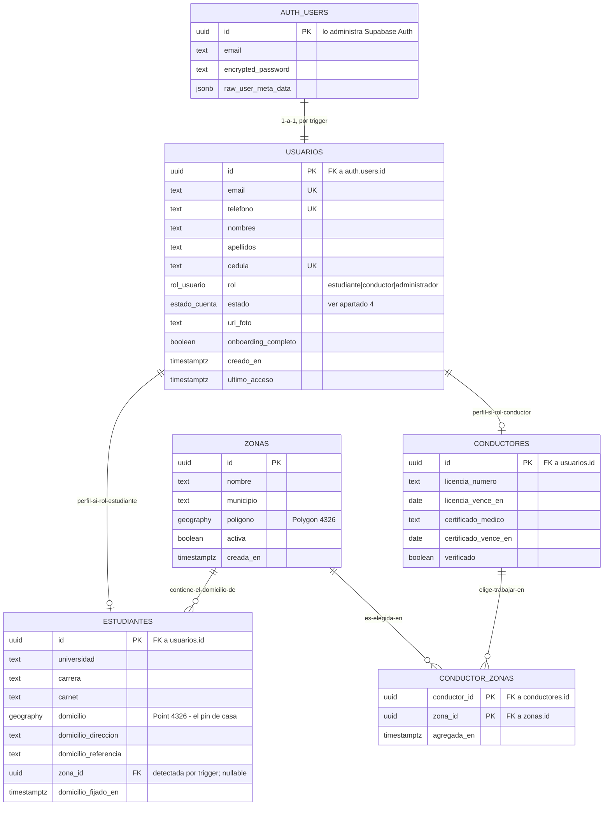
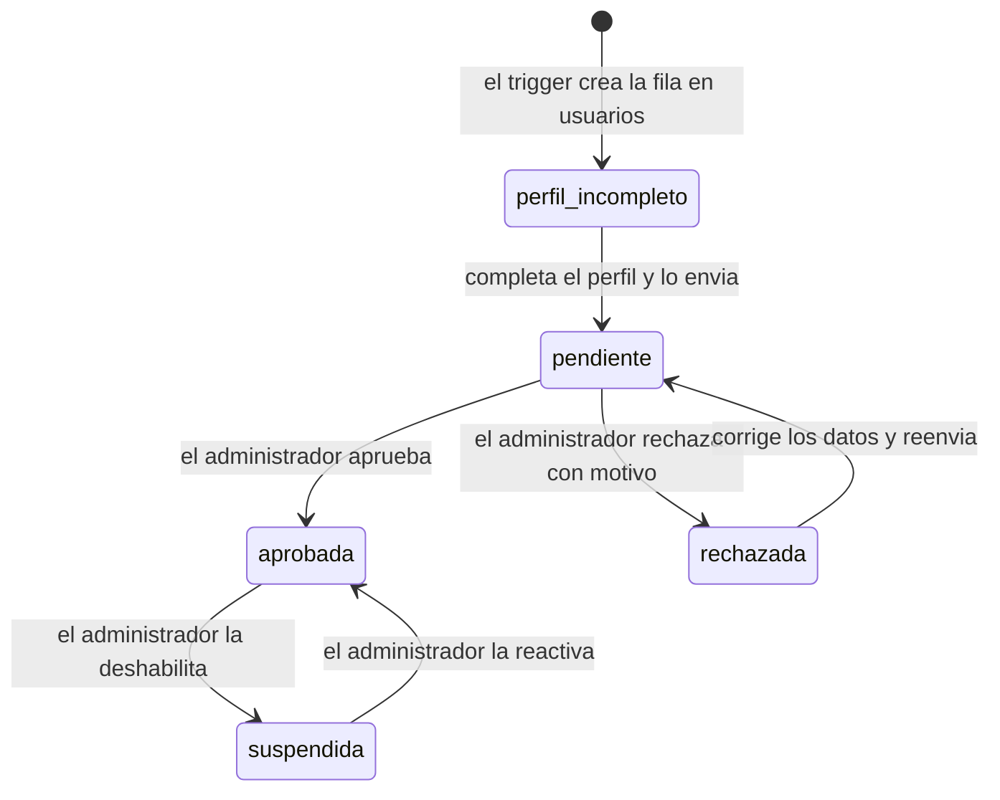
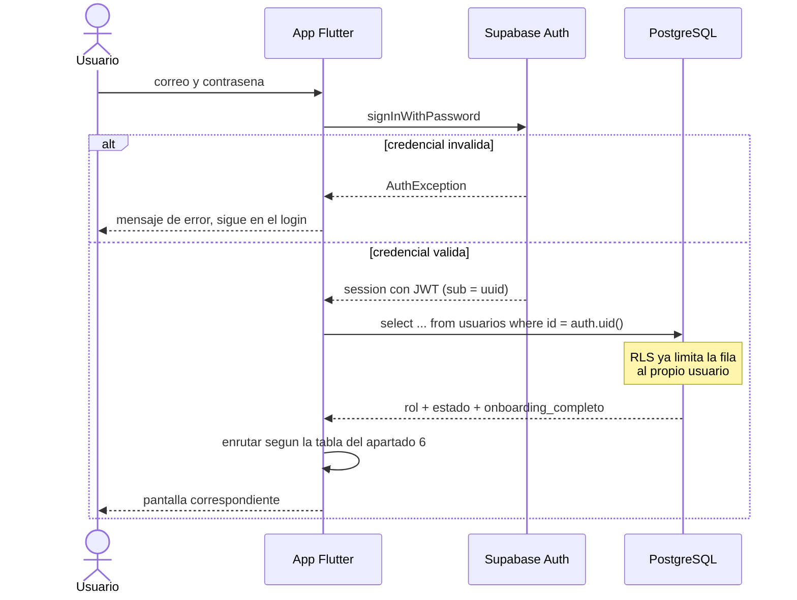
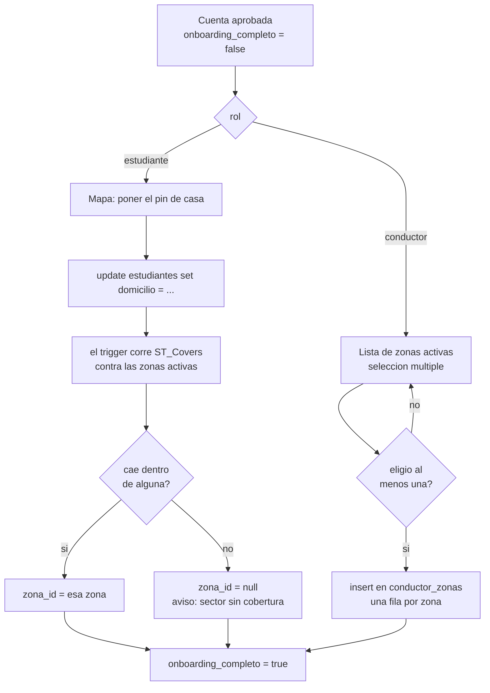

# Modelo de datos — Cupo

Modelo entidad-relación del sistema sobre **Supabase (PostgreSQL)**. Cubre
el **objetivo específico 3** (diseño lógico y físico).

- Estado: **borrador — identidad y ubicación**
- Motor: PostgreSQL 15 + PostGIS, vía Supabase
- Última revisión: 2026-09-14

## Alcance de esta versión

Solo **quién entra a la aplicación y desde dónde**: cuentas, perfiles, el
estado que gobierna el login, y la ubicación que cada rol declara al
registrarse. Es lo que hace falta para la Iteración 1 del plan
(autenticación, registros y aprobación del administrador).

Las entidades de la operación —rutas, turnos, cupos, inscripciones,
viajes, cobros— **no están en este documento todavía**. Se agregan cuando
cierren las decisiones de la Fase 0 y el trabajo de campo de la Fase 1,
que es lo que corresponde según [`../../TODO.md`](../../TODO.md).

> **Nota de migración.** [`../../README.md`](../../README.md),
> [`../../cupo/README.md`](../../cupo/README.md), `TODO.md` y
> `cupo/pubspec.yaml` todavía describen un backend Firebase. Este
> documento ya está sobre Supabase; los otros cuatro quedan
> contradiciéndolo hasta que se actualicen. El apartado 10 lista qué
> cambia en cada uno.

---

## 1. Diagrama



`conductor_zonas` es la tabla asociativa que resuelve el **N:M** entre
conductores y zonas: un conductor trabaja varias zonas y una zona tiene
varios conductores. Su clave primaria es compuesta, y eso solo ya impide
que un conductor registre dos veces la misma zona.

## 2. Por qué `usuarios` está separada de `auth.users`

Supabase administra `auth.users` en su propio esquema y **no conviene
tocarla**: sus columnas las define Supabase y pueden cambiar entre
versiones. El patrón estándar es una tabla propia en `public` con la
misma clave primaria y una llave foránea hacia ella.

Eso da dos cosas: los datos del negocio quedan bajo control propio, y
`auth.users` sigue siendo la única fuente de la credencial.

Un detalle que en Firebase era un problema y aquí desaparece: la fila de
`usuarios` se crea con un **trigger sobre `auth.users`**, dentro de la
misma transacción que el registro. No puede existir una credencial sin
perfil. En Firebase eso eran dos escrituras separadas y había que manejar
el caso intermedio.

### 2.1 Y por qué `estudiantes` y `conductores` son tablas aparte

1. **El login solo consulta `usuarios`.** Un `select` de una fila decide a
   qué pantalla va la app.
2. **Las políticas RLS se escriben por tabla.** Un estudiante no debe
   poder escribir en el perfil de un conductor; con tablas separadas la
   política es una línea.
3. **Los campos no se solapan.** Una sola tabla tendría `licencia_numero`
   nulo en todos los estudiantes y `carnet` nulo en todos los conductores.
4. **Alguien podría tener los dos roles.** Un conductor que además
   estudia.

Es una **especialización** (herencia de tabla): `usuarios` es el
supertipo, `estudiantes` y `conductores` los subtipos, y comparten la
clave primaria.

## 3. La ubicación: qué se comparte y qué no

Los dos roles declaran ubicación al registrarse, pero **no declaran lo
mismo**. Son distintos en cuatro ejes a la vez:

| | Estudiante | Conductor |
|---|---|---|
| Geometría | un **punto** | un **área** |
| Cantidad | exactamente 1 | varias |
| Cómo se obtiene | lo **pone** en el mapa | las **elige** de una lista |
| Qué significa | "desde aquí salgo" | "aquí recojo pasajeros" |

Por eso **no** hay una tabla `ubicaciones` genérica con un campo `tipo`.
Tendría la mitad de las columnas nulas en cada fila —el polígono nulo en
el estudiante, el punto nulo en el conductor— y esa es exactamente la
clase de tabla que un jurado pregunta por qué existe.

### 3.1 Lo que sí se reutiliza: la tabla `zonas`

El catálogo de sectores de la ciudad es una sola tabla, y los dos roles la
tocan por lados opuestos:

- El **estudiante no elige** su zona. Se le **detecta**: PostGIS evalúa
  `ST_Covers(zona.poligono, estudiante.domicilio)` y el resultado se
  guarda en `estudiantes.zona_id`.
- El **conductor sí elige**, y puede elegir varias. Cada elección es una
  fila de `conductor_zonas`.

Ese es el verdadero punto de reutilización, y no es cosmético: si los dos
terminan apuntando a la misma zona, cruzar oferta con demanda después es
un `join` por `zona_id`, no geometría recalculada en cada búsqueda. **El
cálculo pesado se hace una sola vez**, cuando el estudiante fija su pin.

### 3.2 Lo que se reutiliza en código, no en la base de datos

| Pieza | Dónde vive | La usan |
|---|---|---|
| El objeto `Punto` (`lat`, `lng`) | `lib/shared/models/` | domicilio y, más adelante, paradas y posiciones |
| El widget de mapa para escoger un lugar | `lib/shared/widgets/` | el pin del estudiante; la vista previa de zonas del conductor |

Respuesta corta a "¿se puede reutilizar?": **sí, pero en el código. En el
modelo son dos cosas distintas.**

### 3.3 Por qué el conductor elige de un catálogo y no dibuja su zona

Podría dibujar su propio polígono sobre el mapa. Tres razones para no
hacerlo, al menos ahora:

1. **Dibujar un polígono en un teléfono es una mala experiencia.** Elegir
   "La Limpia" de una lista toma dos segundos.
2. **Si cada quien dibuja el suyo, nunca coinciden.** Dos conductores de
   la misma zona producirían polígonos distintos, y comparar oferta con
   demanda volvería a ser geometría en vez de un `join`.
3. **El catálogo da vocabulario común.** La búsqueda, la tarjeta de
   resultados y las estadísticas hablan todas de "La Limpia".

La contra es que **alguien tiene que cargar el catálogo** antes de que la
app sirva para algo — trabajo del administrador, y hay que contarlo en el
plan.

### 3.4 El caso que rompe el flujo: pin fuera de toda zona

Si el estudiante pone su casa donde ningún polígono activo lo contiene,
`zona_id` queda **nulo**. Hay que decidir qué pasa ahí, porque es el
primer usuario real que va a aparecer:

- **No dejarlo terminar** el registro lo deja trancado sin salida.
- **Dejarlo terminar** con un aviso de "todavía no cubrimos tu sector" es
  lo razonable: la cuenta queda creada, `onboarding_completo` en `true`, y
  cuando el administrador agregue esa zona el estudiante ya está adentro.

El modelo asume lo segundo: `zona_id` es **nullable**, con
`on delete set null`. Vale la pena conservar esos pines sin zona: son
exactamente el dato que dice dónde conviene abrir cobertura.

## 4. Estados de la cuenta

`usuarios.estado` es el campo que gobierna el login entero. Es un **tipo
enumerado de PostgreSQL**, no texto libre: el motor rechaza cualquier
valor fuera de la lista.



`onboarding_completo` es un campo aparte y **está en `usuarios`, no en los
perfiles**, porque los dos roles lo necesitan: el estudiante lo completa
poniendo el pin, el conductor eligiendo al menos una zona. Así la tabla de
enrutamiento consulta una sola columna.

## 5. El login, paso a paso



Lo que importa para implementarlo: **Supabase Auth solo responde quién
eres, no qué puedes hacer**. El rol y el estado viven en `public.usuarios`,
y la app no está realmente autenticada hasta que leyó esa fila. Esa
segunda consulta es parte del login, no algo posterior.

Dos detalles propios de Supabase:

- El estado de sesión se escucha con `onAuthStateChange`, y la fila del
  usuario con una suscripción de **Realtime** a `public.usuarios` filtrada
  por `id`. Si el administrador suspende la cuenta mientras el usuario la
  tiene abierta, la app se entera.
- El JWT trae el `uuid` en `sub`, y eso es lo que devuelve `auth.uid()`
  dentro de las políticas. **No trae el rol** salvo que se agregue como
  *custom claim*; mientras no se agregue, el rol se consulta.

## 6. Tabla de enrutamiento

Traduce el estado a una pantalla. Conviene implementarla como una sola
función, en un solo lugar.

| `rol` | `estado` | `onboarding_completo` | Pantalla destino |
|---|---|---|---|
| cualquiera | `perfil_incompleto` | — | Formulario de perfil del rol |
| cualquiera | `pendiente` | — | "Tu registro está en revisión" |
| cualquiera | `rechazada` | — | Motivo del rechazo, corregir y reenviar |
| cualquiera | `suspendida` | — | "Cuenta deshabilitada" y contacto |
| `estudiante` | `aprobada` | `false` | Onboarding: **poner el pin de casa** |
| `conductor` | `aprobada` | `false` | Onboarding: **elegir zonas de trabajo** |
| `estudiante` | `aprobada` | `true` | Inicio del estudiante |
| `conductor` | `aprobada` | `true` | Inicio del conductor |
| `administrador` | `aprobada` | — | Bandeja de solicitudes |

Ya no hace falta la fila de "usuario sin perfil": el trigger del apartado
8.3 garantiza que la fila exista. Las de `rechazada` y `suspendida` son
las que se olvidan siempre, y las que dejan al usuario en pantalla blanca.

### 6.1 El paso de ubicación en el onboarding

El mismo lugar del flujo, distinto contenido según el rol:



## 7. Diccionario de datos

| Tabla | Descripción | Clave primaria | Relaciones |
|---|---|---|---|
| `usuarios` | Cuenta de acceso, común a los tres roles | `id` (= `auth.users.id`) | 1:1 con `auth.users`; 1:1 opcional con cada perfil |
| `estudiantes` | Perfil del estudiante y su domicilio | `id` → `usuarios.id` | N:1 con `zonas` |
| `conductores` | Perfil del conductor y sus documentos | `id` → `usuarios.id` | 1:N con `conductor_zonas` |
| `zonas` | Catálogo de sectores, lo mantiene el admin | `id` | 1:N con `estudiantes` y con `conductor_zonas` |
| `conductor_zonas` | Zonas donde un conductor quiere trabajar | `(conductor_id, zona_id)` | N:M entre conductores y zonas |

### 7.1 Tipos usados

| Tipo | Para qué |
|---|---|
| `uuid` | todas las claves; el de `usuarios` viene de Supabase Auth |
| `text` | cadenas; en PostgreSQL no hay razón para usar `varchar(n)` |
| `timestamptz` | instantes con zona horaria — **nunca `timestamp` pelado** |
| `date` | fechas de vencimiento de documentos |
| `boolean` | banderas |
| `geography(Point, 4326)` | el domicilio del estudiante, en WGS-84 |
| `geography(Polygon, 4326)` | el polígono de una zona |
| `rol_usuario`, `estado_cuenta` | tipos enumerados propios |

`geography` y no `geometry`: `geography` calcula sobre el elipsoide, así
que las distancias salen en metros reales sin proyectar nada. Para una
ciudad la diferencia es pequeña, pero evita explicar una proyección en la
defensa.

## 8. Esquema físico

### 8.1 Extensiones y tipos

```sql
create extension if not exists postgis;

create type rol_usuario as enum (
  'estudiante', 'conductor', 'administrador'
);

create type estado_cuenta as enum (
  'perfil_incompleto', 'pendiente', 'aprobada', 'rechazada', 'suspendida'
);
```

### 8.2 Tablas

```sql
create table public.usuarios (
  id                  uuid primary key
                        references auth.users (id) on delete cascade,
  email               text not null unique,
  telefono            text unique,
  nombres             text not null default '',
  apellidos           text not null default '',
  cedula              text unique,
  rol                 rol_usuario   not null,
  estado              estado_cuenta not null default 'perfil_incompleto',
  url_foto            text,
  onboarding_completo boolean     not null default false,
  creado_en           timestamptz not null default now(),
  ultimo_acceso       timestamptz
);

create table public.zonas (
  id        uuid primary key default gen_random_uuid(),
  nombre    text not null,
  municipio text,
  poligono  geography(Polygon, 4326) not null,
  activa    boolean     not null default true,
  creada_en timestamptz not null default now(),
  unique (nombre, municipio)
);

create index zonas_poligono_idx on public.zonas using gist (poligono);

create table public.estudiantes (
  id                   uuid primary key
                         references public.usuarios (id) on delete cascade,
  universidad          text,
  carrera              text,
  carnet               text,
  domicilio            geography(Point, 4326),
  domicilio_direccion  text,
  domicilio_referencia text,
  zona_id              uuid references public.zonas (id) on delete set null,
  domicilio_fijado_en  timestamptz
);

create index estudiantes_domicilio_idx
  on public.estudiantes using gist (domicilio);
create index estudiantes_zona_idx on public.estudiantes (zona_id);

create table public.conductores (
  id                   uuid primary key
                         references public.usuarios (id) on delete cascade,
  licencia_numero      text,
  licencia_vence_en    date,
  certificado_medico   text,
  certificado_vence_en date,
  verificado           boolean not null default false
);

create table public.conductor_zonas (
  conductor_id uuid not null
                 references public.conductores (id) on delete cascade,
  zona_id      uuid not null
                 references public.zonas (id) on delete cascade,
  agregada_en  timestamptz not null default now(),
  primary key (conductor_id, zona_id)
);

create index conductor_zonas_zona_idx on public.conductor_zonas (zona_id);
```

El índice GIST sobre `zonas.poligono` es el que hace que la detección de
zona no recorra todos los polígonos. Con veinte zonas no se nota; con
doscientas, sí.

### 8.3 Trigger: crear el perfil al registrarse

```sql
create or replace function public.crear_usuario()
returns trigger
language plpgsql
security definer
set search_path = public
as $$
begin
  insert into public.usuarios (id, email, rol)
  values (
    new.id,
    new.email,
    coalesce(
      (new.raw_user_meta_data ->> 'rol')::rol_usuario,
      'estudiante'
    )
  );
  return new;
end;
$$;

create trigger on_auth_user_created
  after insert on auth.users
  for each row execute function public.crear_usuario();
```

El rol viaja en el `data` del `signUp` de la app y llega como
`raw_user_meta_data`. Es metadato del usuario, así que **el usuario lo
controla**: sirve para elegir entre estudiante y conductor, pero no debe
aceptarse `administrador` por esa vía. Conviene validarlo en la función.

### 8.4 Trigger: detectar la zona del domicilio

Es el punto-en-polígono, y lo corre la base de datos sola:

```sql
create or replace function public.detectar_zona()
returns trigger
language plpgsql
set search_path = public
as $$
begin
  if new.domicilio is not null then
    select z.id into new.zona_id
      from public.zonas z
     where z.activa
       and st_covers(z.poligono, new.domicilio)
     limit 1;

    new.domicilio_fijado_en := now();
  end if;
  return new;
end;
$$;

create trigger estudiantes_detectar_zona
  before insert or update of domicilio on public.estudiantes
  for each row execute function public.detectar_zona();
```

La app solo escribe el punto; `zona_id` se llena solo y no puede quedar
inconsistente con el domicilio. Si las zonas se solapan, el `limit 1`
elige una arbitrariamente — hay que decidir si las zonas pueden solaparse
o si se valida que no (apartado 11).

### 8.5 Políticas RLS

```sql
alter table public.usuarios        enable row level security;
alter table public.estudiantes     enable row level security;
alter table public.conductores     enable row level security;
alter table public.zonas           enable row level security;
alter table public.conductor_zonas enable row level security;

-- Saber si quien consulta es administrador, sin recursion:
-- security definer salta el RLS de la propia tabla usuarios.
create or replace function public.es_admin()
returns boolean
language sql
security definer
stable
set search_path = public
as $$
  select exists (
    select 1 from public.usuarios
     where id = auth.uid() and rol = 'administrador'
  );
$$;

create policy usuarios_ve_el_suyo on public.usuarios
  for select using (auth.uid() = id or public.es_admin());

create policy usuarios_edita_el_suyo on public.usuarios
  for update using (auth.uid() = id)
  with check (auth.uid() = id);

create policy estudiantes_ve_el_suyo on public.estudiantes
  for select using (auth.uid() = id or public.es_admin());

create policy estudiantes_edita_el_suyo on public.estudiantes
  for update using (auth.uid() = id) with check (auth.uid() = id);

create policy conductor_zonas_las_suyas on public.conductor_zonas
  for all using (auth.uid() = conductor_id)
  with check (auth.uid() = conductor_id);

create policy zonas_las_lee_cualquiera on public.zonas
  for select using (auth.role() = 'authenticated');

create policy zonas_las_escribe_el_admin on public.zonas
  for all using (public.es_admin()) with check (public.es_admin());
```

**La función `es_admin()` con `security definer` no es un adorno.** Una
política sobre `usuarios` que consulte `usuarios` para saber el rol entra
en recursión infinita y PostgreSQL la corta con un error. Es el error
número uno de quien escribe RLS por primera vez.

### 8.6 Lo que RLS **no** resuelve: escalar el propio rol

Una política decide **qué filas** se ven o se escriben, no **qué
columnas**. Con la política de arriba, un usuario puede actualizar su
propia fila… incluyendo `rol = 'administrador'`. Eso tumba el control de
acceso entero.

Se cierra con privilegios por columna, que son de PostgreSQL y no de
Supabase:

```sql
revoke update on public.usuarios from authenticated;

grant update (nombres, apellidos, telefono, cedula, url_foto)
  on public.usuarios to authenticated;
```

`rol`, `estado` y `onboarding_completo` quedan fuera de la lista: solo los
cambia el administrador o una función `security definer`. Es la regla más
importante de todo el módulo.

## 9. Consultas que este modelo tiene que responder

Escritas antes que el código, como pide la Fase 3 del plan:

```sql
-- 1. El login: rol y estado del usuario actual.
select rol, estado, onboarding_completo
  from usuarios where id = auth.uid();

-- 2. Zonas activas para la lista del conductor.
select id, nombre, municipio from zonas
 where activa order by nombre;

-- 3. Zonas que un conductor eligio.
select z.* from zonas z
  join conductor_zonas cz on cz.zona_id = z.id
 where cz.conductor_id = auth.uid();

-- 4. Conductores que trabajan en la zona de un estudiante.
--    Es el cruce oferta-demanda, y es un join, no geometria.
select u.nombres, u.apellidos
  from conductor_zonas cz
  join usuarios u on u.id = cz.conductor_id
 where cz.zona_id = (select zona_id from estudiantes
                      where id = auth.uid());

-- 5. Bandeja del administrador.
select * from usuarios where estado = 'pendiente' order by creado_en;

-- 6. Pines sin cobertura: donde conviene abrir zona.
select domicilio_direccion, domicilio from estudiantes
 where zona_id is null;
```

La consulta 4 es la que justifica todo el apartado 3: con el `zona_id` ya
resuelto, cruzar oferta con demanda es un `join` de dos tablas.

## 10. Qué cambia respecto del diseño Firebase

El repositorio todavía documenta Firebase. Esto es lo que hay que revisar:

| Pieza | Firebase | Supabase | Dónde se documenta hoy |
|---|---|---|---|
| Autenticación | Firebase Auth | Supabase Auth (`auth.users`) | `cupo/README.md` §6 |
| Datos | Cloud Firestore | PostgreSQL | `README.md`, tabla de stack |
| Posiciones en vivo | Realtime Database | Supabase Realtime (canal *broadcast*) | `README.md`, `TODO.md` Fase 3 |
| Reglas de acceso | Security Rules | RLS + `grant` por columna | `TODO.md` Fase 3 |
| Consultas geográficas | geohash + cálculo en Dart | PostGIS (`ST_Covers`, `ST_DWithin`) | `TODO.md` Fase 2, Spikes 2 y 3 |
| Paquetes Flutter | `firebase_*` (5) | `supabase_flutter` (1) | `cupo/pubspec.yaml` |
| Notificaciones push | Firebase Cloud Messaging | **sigue siendo FCM** | `README.md` |

Cuatro consecuencias que valen más que el cambio de nombre:

**1. Se acaba la desnormalización.** Buena parte del diseño anterior
existía porque Firestore no tiene `JOIN`. PostgreSQL sí, y con llaves
foráneas reales. Hay menos que mantener y menos por donde
desincronizarse.

**2. El Spike 2 desaparece.** "Consulta por radio con geohash en
Firestore" ya no aplica: en PostGIS eso es `ST_DWithin` con un índice
GIST. El geohash era una forma de simular índices espaciales donde no los
había; aquí los hay.

**3. El Spike 3 cambia de lugar, y hay que decidirlo.** El punto en
polígono y la distancia punto-polilínea pueden seguir en Dart o mudarse a
PostGIS. La ingeniería dice PostGIS: es más rápido, está indexado y no
baja datos al teléfono para filtrarlos. Pero `README.md` justifica los
cálculos en Dart como evidencia del **Objetivo 4** porque son puros y se
prueban con pruebas unitarias.

   Salida recomendada: mover el filtrado a una función SQL, y probarla con
   casos de prueba en SQL —domicilio dentro, fuera, y justo sobre el
   borde—. Sigue siendo evidencia verificable y repetible para el Objetivo
   4; cambia el instrumento, no el argumento. Conviene acordarlo con el
   tutor antes de escribirlo en el capítulo.

**4. Supabase no envía notificaciones push.** No tiene equivalente de
Cloud Messaging. Para las notificaciones de la Iteración 5 hay que
conservar `firebase_messaging` —solo eso, sin el resto del stack— o meter
un tercero. Conviene saberlo ahora y no en la Iteración 5.

## 11. Preguntas abiertas de este módulo

- **¿El conductor es el dueño de la unidad, o trabaja para alguien?** Si
  hay dueños que no manejan, hace falta distinguir *propietario* de
  *chofer* — hoy `conductores` los mezcla. Pregunta para las entrevistas
  de la Fase 1.
- **¿Quién carga el catálogo de zonas y con qué criterio?** ¿Parroquias
  oficiales, sectores como los nombra la gente, o los recorridos que ya
  existen? De esto depende que un estudiante encuentre su sector.
- **¿Pueden solaparse dos zonas?** Hoy el trigger toma la primera que
  coincida. Si no deben solaparse, se valida con una restricción de
  exclusión; si sí, hay que definir el criterio de desempate.
- **¿La zona de trabajo del conductor es la misma que la cobertura de su
  ruta?** Hoy `conductor_zonas` es una **declaración de interés**. Cuando
  entren las rutas habrá que decidir si la cobertura real se deriva de la
  ruta o sigue siendo lo declarado.
- **¿Cómo se verifica que un estudiante es estudiante?** Hoy `carnet` es
  texto libre y el administrador aprueba a ojo. Si hay que subir foto,
  entra Supabase Storage y probablemente un estado más.
- **¿El registro es por correo o por teléfono?** El modelo guarda los dos,
  pero la credencial de Supabase Auth es una sola y hay que elegirla antes
  de la Iteración 1.
- **¿El estudiante puede mover su pin después?** El trigger recalcula
  `zona_id` solo, pero no hay regla sobre cuántas veces se permite ni qué
  pasa con sus inscripciones vigentes cuando el módulo exista.
